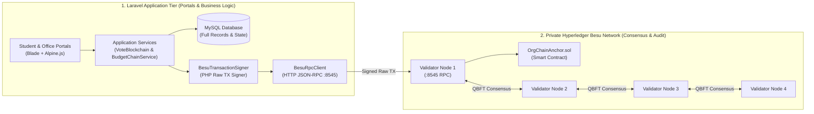
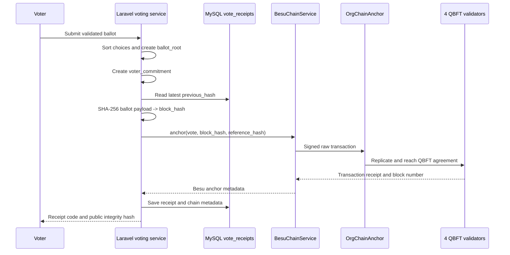
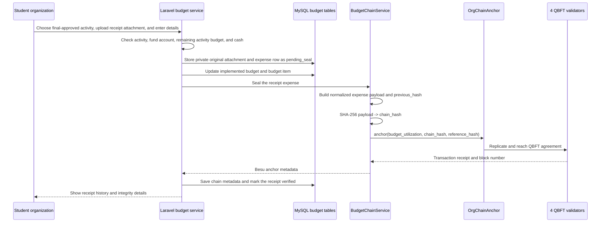

# OrgChain Blockchain Architecture - Complete

> [!important] Current source of truth
> This page documents the implementation currently used by the application. The live driver is **Hyperledger Besu QBFT**. Older documents that describe a three-node JSONL chain describe the fallback and historical implementation, not the current Besu network.

## 1. What the blockchain does (The "Digital Wax Seal" Concept)

OrgChain is a **database-first, hash-anchored, permissioned blockchain system**.

> [!tip] Plain English Explanation: The "Digital Wax Seal" Analogy
> Think of **MySQL** as a university filing cabinet. It securely stores all the paperwork: student names, organization activity proposals, uploaded receipt photos, and election candidates.
> 
> Think of **Hyperledger Besu** as an independent notary that stamps a **tamper-evident digital wax seal** on each file:
> 1. When a student votes or an organization spends budget, Laravel summarizes the record into a cryptographic fingerprint (a **SHA-256 hash**).
> 2. Laravel sends **only this 32-byte fingerprint** to the 4 Hyperledger Besu validator nodes.
> 3. The 4 nodes reach consensus and permanently anchor the fingerprint inside a smart contract.
> 4. If someone later alters a number in the MySQL database (e.g. changing ₱1,000 to ₱10,000, or tampering with a ballot), recalculating the fingerprint shows it **no longer matches the digital wax seal** on Besu. The tampering is exposed instantly!

### Why not store everything on the blockchain?

| Concern | MySQL & Private Storage (Off-Chain) | Hyperledger Besu (On-Chain) |
| :--- | :--- | :--- |
| **Privacy & Anonymity** | Stores student profiles, voter identities, and office comments under strict access control. | Receives **zero** personal data or raw ballot choices. Only stores anonymized cryptographic hashes. |
| **Storage & File Size** | Stores heavy files (receipt JPG/PNG scans, PDF accomplishment forms, DOCX templates). | Never stores heavy files. Stores only 32-byte hash proofs to avoid blockchain bloat. |
| **Speed & Performance** | Handles fast relational database queries, pagination, search, and responsive web UI rendering. | Handles decentralized consensus (QBFT) and immutable chronological verification. |

---

## 2. Whole-System Architecture

The system is organized into two distinct tiers: the **Laravel Application Tier** and the **Private Hyperledger Besu Network Tier**.



### How the Tiers Interact (Step-by-Step)
1. **User Action:** A student casts a vote or an organization officer uploads an expense receipt.
2. **Database Record:** Laravel checks business logic, saves the complete record in **MySQL**, and calculates a deterministic SHA-256 fingerprint (`block_hash` or `chain_hash`).
3. **Transaction Signing:** `BesuTransactionSigner` signs an Ethereum-standard raw transaction in PHP using the university application's authorized private key.
4. **RPC Dispatch:** `BesuRpcClient` sends the signed transaction over HTTP JSON-RPC to **Validator Node 1** at `http://127.0.0.1:8545`.
5. **QBFT Consensus:** The 4 validator nodes run Quorum Byzantine Fault Tolerance (QBFT) to agree on the block within ~2 seconds.
6. **Smart Contract Storage:** The `OrgChainAnchor.sol` contract registers the hash in its lookup table and emits an on-chain `RecordAnchored` event.
7. **Audit Trail Saved:** Laravel captures the Besu transaction hash (`chain_tx_hash`) and block number (`chain_block_number`), saving them into MySQL so voters and auditors can verify it anytime.

## 3. Current network topology

| Component | Current implementation |
| --- | --- |
| Blockchain client | Hyperledger Besu |
| Consensus | QBFT permissioned consensus |
| Validators | 4 validators in Docker |
| Application RPC | `http://127.0.0.1:8545` through validator 1 |
| Additional RPC ports | `8546`, `8547`, `8548` |
| Chain ID | `20260920` |
| Block period | 2 seconds in the local genesis configuration |
| Request timeout | 4 seconds in the local genesis configuration |
| Docker network | `orgchain-besu` |
| Application contract | `OrgChainAnchor` |
| Contract deployment manifest | `storage/app/besu/deployment.json` |

The current local network is a four-validator development/thesis network. It is not a public permissionless blockchain and the generated local keys must not be reused for a production institutional deployment.

## 4. What is stored where

### MySQL stores the application record

MySQL stores the data required to run OrgChain, including:

- users, organizations, roles, and permissions;
- activities, approval statuses, budgets, and reporting periods;
- uploaded-document metadata and private receipt paths;
- expense liquidation and receipt verification status;
- anonymized vote receipts and election metadata;
- the application SHA-256 hash and its previous-hash link;
- Besu transaction hash, chain block number, contract address, and driver name.

### Besu stores the integrity anchor

The `OrgChainAnchor` contract stores or emits only a compact proof:

```text
recordHash     = application SHA-256 hash
referenceHash  = SHA-256 of a non-sensitive application reference
recordType     = compact numeric type code
anchoredAt     = Besu block timestamp in the event
submitter      = configured application signer
```

The contract also maintains an `isAnchored(recordHash)` lookup. It does not store the original receipt, DOCX/PDF file, voter choices, or private user data.

## 5. Smart contract behavior

The contract is `infra/besu/contracts/OrgChainAnchor.sol`.

```solidity
anchor(bytes32 recordHash, bytes32 referenceHash, uint8 recordType)
isAnchored(bytes32 recordHash) returns (bool)
```

Only the contract's configured submitter can anchor a record. An empty hash is rejected, and the same `recordHash` cannot be anchored twice. A successful call emits a `RecordAnchored` event.

This design keeps sensitive data in the application database while making later tampering detectable: if the database payload changes, its recomputed SHA-256 no longer matches the hash already anchored on Besu.

## 6. Hash and block model

The application uses a zero hash as the genesis value:

```text
0000000000000000000000000000000000000000000000000000000000000000
```

Each application record has a `previous_hash`. The current record payload, including that previous hash, is encoded as JSON and hashed with SHA-256. The resulting 64-character hexadecimal value becomes the application `block_hash`/`chain_hash`.

Conceptually:

```text
record_hash = SHA256(JSON(record_payload + previous_hash))
```

The application hash chain provides logical ordering and continuity. Besu then provides distributed validator agreement and durable transaction history for the hash anchor.

## 7. Voting flow

The voting implementation is `App\\VotingSystem\\Core\\VoteBlockchain`.



### Step-by-Step Voting Flow Explained
1. **Secret Ballot Formation:** When the voter submits their choices, Laravel sorts the candidates and creates a SHA-256 fingerprint called the `ballot_root`. The candidate names are not exposed on-chain.
2. **Voter Privacy (Commitment):** To prevent double-voting without revealing who cast which ballot, Laravel computes:
   $$\text{voter\_commitment} = \text{SHA256}(\text{election\_id} \mid \text{voter\_id} \mid \text{reference\_code})$$
   This acts as a cryptographic shield: it proves the voter was eligible and voted once, without linking their name to their choices.
3. **Chaining to History:** Laravel looks up the preceding vote's hash (`previous_hash`) and bundles `[election_id, reference_code, voter_commitment, ballot_root, created_at, previous_hash]` into a single `block_hash`.
4. **On-Chain Anchoring:** `BesuChainService` sends this hash to `OrgChainAnchor.sol` on Hyperledger Besu. The 4 QBFT validators agree on the block.
5. **Auditable Receipt:** The student receives a reference code (e.g. `VOTE-2026-XXXX`). At any time, anyone can enter this code to verify:
   - **On-chain proof:** `OrgChainAnchor::isAnchored(block_hash) == true`.
   - **Consensus proof:** The transaction was confirmed by the 4 QBFT validators.
   - **Continuity proof:** The `previous_hash` matches the preceding ballot in MySQL, proving no votes were removed, reordered, or injected.

---

## 8. Budget and receipt flow

The budget implementation is coordinated by `ActivityBudgetService` and `BudgetChainService`.



### Step-by-Step Budget Sealing Flow Explained
1. **Activity & Balance Check:** An authorized officer uploads an expense receipt and enters itemized details for an approved activity (`workflow_status = oc_approved`). Laravel checks that the organization has an active fund account and sufficient remaining activity allocation.
2. **Itemized Entry & Attachment:** The officer attaches receipt image(s) or PDF documents and confirms the merchant, transaction date, items, unit costs, and official receipt reference numbers.
3. **Deterministic Payload:** Laravel creates a normalized expense summary:
   `[activity_title, item_name, supplier, organization, receipt_reference, quantity, unit_cost, total, expense_date, previous_hash]`.
4. **On-Chain Anchoring:** The payload is hashed with SHA-256 into `chain_hash` and anchored in `OrgChainAnchor.sol` with record type `budget_utilization`.
5. **Audit Trail Guarantee:** The receipt image stays in protected local storage, but its cryptographic proof is immutably recorded on Besu. If someone later alters expense amounts in MySQL or uploads a forged replacement receipt, the database hash will fail the Besu integrity check immediately.

---

## 9. Besu transaction lifecycle

`App\\Services\\BesuChainService` performs the following work:

1. checks that the Besu driver is enabled;
2. resolves the contract address from configuration or `storage/app/besu/deployment.json`;
3. derives the application signer address from the configured private key;
4. reads the pending nonce from Besu;
5. builds the `anchor(bytes32,bytes32,uint8)` call data;
6. signs a legacy Ethereum transaction with the configured chain ID;
7. submits it with `eth_sendRawTransaction`;
8. waits for `eth_getTransactionReceipt`;
9. rejects a reverted transaction;
10. returns the transaction hash, Besu block number, contract address, and validator count; and
11. lets the calling service save the result in MySQL.

The transaction is not considered successfully sealed until the application receives a successful receipt and the expected validator confirmation count is recorded.

## 10. Verification lifecycle

### Voting verification

`VoteBlockchain::verify()` loads the receipt from MySQL. In Besu mode it delegates to `BesuChainService::verifyVoteReceipt()`, which checks the contract lookup, transaction receipt, and previous-hash continuity.

### Budget verification

`BudgetChainService::verifyHash()` loads the expense row from MySQL and delegates to `BesuChainService::verifyAnchor()`. The service checks `isAnchored(chain_hash)` and, when available, the stored transaction receipt.

### What a successful verification means

A successful result means the application record's stored hash is anchored on the configured Besu network and the recorded transaction was accepted. It does not mean the blockchain independently verified the accuracy of the receipt image, the appropriateness of the expense, or the correctness of an officer's approval. Those are application workflow and human-review responsibilities.

## 11. Database fields used for blockchain metadata

### `vote_receipts`

| Field | Purpose |
| --- | --- |
| `block_hash` | Application SHA-256 ballot seal |
| `previous_hash` | Link to the preceding application seal |
| `ballot_root` | SHA-256 representation of validated ballot choices |
| `voter_commitment` | One-way voter/election/reference commitment |
| `nodes_confirmed` | Validator count recorded at sealing |
| `node_confirmations` | Legacy/fallback confirmation details |
| `chain_driver` | `besu` or `file` |
| `chain_tx_hash` | Besu transaction hash, when anchored on Besu |
| `chain_block_number` | Besu block number, when anchored on Besu |
| `chain_contract_address` | Anchor contract used for the record |

### `expense_receipt_reviews`

| Field | Purpose |
| --- | --- |
| `chain_hash` | Application SHA-256 expense seal |
| `previous_hash` | Link to the preceding expense seal |
| `nodes_confirmed` | Validator count recorded at sealing |
| `chain_driver` | `besu` or `file` |
| `chain_tx_hash` | Besu transaction hash, when anchored on Besu |
| `chain_block_number` | Besu block number, when anchored on Besu |
| `chain_contract_address` | Anchor contract used for the expense |
| `verification_status` | Receipt workflow state, such as `pending_seal` or `verified` |

## 12. Driver modes and legacy fallback

The selected driver is configured in `config/besu.php` and controlled by `.env`:

```dotenv
BLOCKCHAIN_DRIVER=besu
BESU_RPC_URL=http://127.0.0.1:8545
BESU_CHAIN_ID=20260920
BESU_VALIDATOR_COUNT=4
BESU_DEPLOYMENT_FILE=storage/app/besu/deployment.json
```

### Besu mode - current mode

When `BLOCKCHAIN_DRIVER=besu`:

- voting calls the Besu anchor contract;
- budget sealing calls the Besu anchor contract;
- new rows receive `chain_driver=besu`, a transaction hash, block number, and contract address;
- verification checks the contract and transaction receipt;
- the application no longer needs the JSONL files for new blockchain seals.

### File mode - fallback and historical mode

When `BLOCKCHAIN_DRIVER=file`:

- voting appends blocks to three JSONL ledgers under `storage/app/voting/chain/node-{1,2,3}/`;
- budget sealing appends blocks to three JSONL ledgers under `storage/app/orgchain/budget/node-{1,2,3}/`;
- verification checks the three local file copies;
- no Besu transaction is created.

The file implementation remains in the repository for rollback, recovery, and historical data compatibility. It should not be described as the current production driver while `.env` selects Besu.

## 13. Current migration state

The system is operational, but historical records are not automatically rewritten onto Besu.

| Area | Current state |
| --- | --- |
| Besu network | Implemented and running with 4 QBFT validators |
| Anchor contract | Deployed and used by the application |
| New vote seals | Route through Besu when the driver is `besu` |
| New budget seals | Route through Besu when the driver is `besu` |
| Existing legacy rows | May have a hash but no Besu transaction metadata |
| Automatic migration | Not performed; re-anchoring historical records requires an explicit migration policy |
| Business database | Still the source of truth for workflows, balances, files, and reports |

During the latest runtime check, the network was online with four validators and three peers. The database contained mixed history: one confirmed Besu vote seal alongside a legacy vote seal, and older expense rows with hashes but no Besu transaction metadata. This is expected during migration and must be shown honestly in the UI.

## 14. What the blockchain does not do

The chain does not independently perform or replace:

- student/organization authentication;
- activity approval by SO, OSO, SDO, or OVCAA;
- expense verification or human receipt review;
- storage of DOCX, PDF, or receipt-image files;
- budget arithmetic and financial-report compilation;
- access control or privacy enforcement;
- correction of bad source data;
- automatic conversion of legacy records to Besu records.

Those responsibilities stay in Laravel, MySQL, private storage, and the office workflow. The blockchain adds tamper-evident anchoring and independent network confirmation.

## 15. Code and infrastructure map

| Layer | File | Responsibility |
| --- | --- | --- |
| Configuration | `config/besu.php` | Driver, RPC, chain ID, signer, contract, validator count |
| Besu integration | `app/Services/BesuChainService.php` | Anchor and verify records; report network status |
| RPC transport | `app/Services/BesuRpcClient.php` | JSON-RPC calls and receipt polling |
| Transaction signing | `app/Services/BesuTransactionSigner.php` | Sign raw application transactions |
| Voting integration | `app/VotingSystem/Core/VoteBlockchain.php` | Build and seal ballot hashes |
| Budget integration | `app/Services/BudgetChainService.php` | Build and seal expense hashes |
| Budget lifecycle | `app/Services/ActivityBudgetService.php` | Approval, fund checks, receipt record, one-time debit, sealing |
| Smart contract | `infra/besu/contracts/OrgChainAnchor.sol` | Authorized hash anchoring and lookup |
| Network | `infra/besu/docker-compose.yml` | Four Besu validator containers |
| Genesis | `infra/besu/networkFiles/genesis.json` | Chain ID, QBFT settings, validator allocation |
| Deployment | `scripts/besu/deploy-contract.php` | Deploy contract and write deployment manifest |
| Deployment manifest | `storage/app/besu/deployment.json` | Contract address and deployment transaction |
| Database migrations | `database/migrations/*besu*` and budget-chain migrations | Chain metadata columns |

## 16. Operations and health checks

Start the local network:

```powershell
php -d extension=php_gmp.dll scripts/besu/generate-network.php
powershell -ExecutionPolicy Bypass -File scripts/besu/start-network.ps1
php -d extension=php_gmp.dll scripts/besu/deploy-contract.php
php artisan config:clear
```

Check the network:

```powershell
docker compose --project-directory infra/besu ps
Invoke-RestMethod http://127.0.0.1:8545 -Method Post -ContentType 'application/json' -Body '{"jsonrpc":"2.0","id":1,"method":"eth_chainId","params":[]}'
```

Stop it:

```powershell
powershell -ExecutionPolicy Bypass -File scripts/besu/stop-network.ps1
```

If a new row has `chain_driver=file` or a null `chain_tx_hash`, treat it as a legacy/fallback seal. If a new Besu seal fails, the receipt remains recoverable and can be retried by the application's sealing flow; the private receipt and one-time budget debit are not discarded just because the chain request is temporarily unavailable.

## 17. Documentation status

This page is the consolidated current architecture reference. The following older pages remain useful but should be read with the driver distinction in mind:

- [[High-Level Technical Architecture]] - general modular monolith and historical three-node diagram.
- [[End-to-End Data Flow]] - useful workflow diagrams, with legacy JSONL sections.
- [[VoteChain Cryptographic Engine]] - detailed fallback/file-ledger behavior.
- [[Multi-Laptop 3-Node Blockchain Setup Runbook]] - legacy JSONL node topology.
- [[Budget Utilization and Receipt Records]] - budget behavior and historical chain notes.
- [[Session Log 2026-09-21 Activity Budget Lifecycle]] - latest implementation/session findings.

When those pages conflict with this document or with the current code, use this page, `config/besu.php`, the Besu services, and the live runtime configuration as the source of truth.
