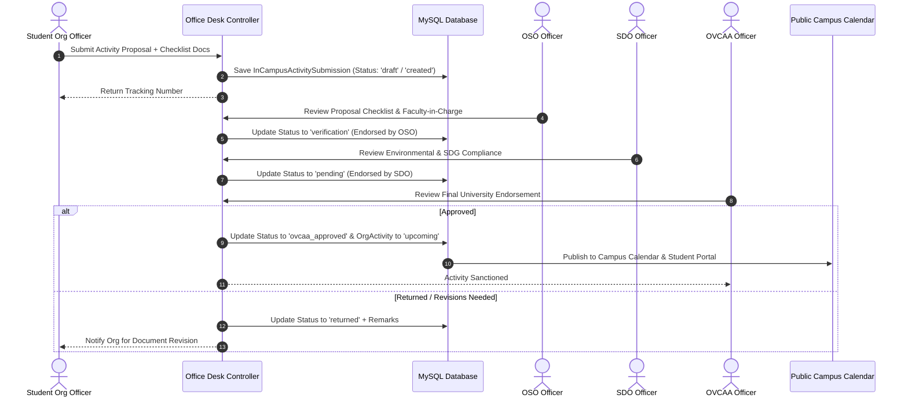
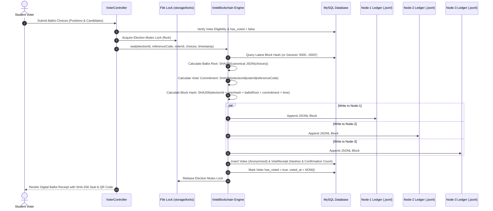
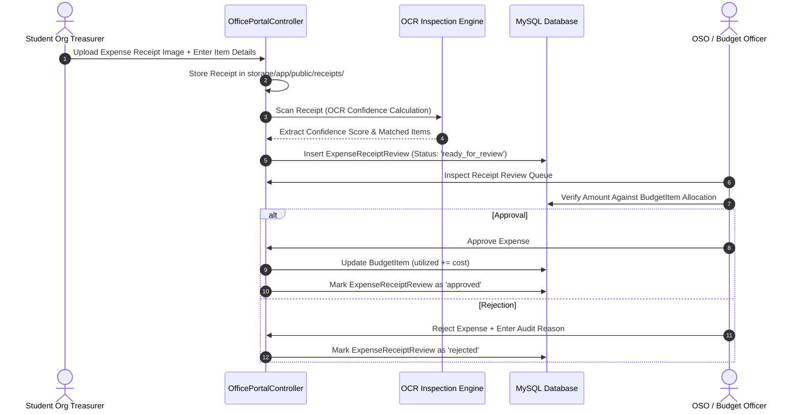

# 🔄 End-to-End Data Flow

> [!abstract] Transaction Sequences
> This document maps out the core data transactions across OrgChain: Activity Proposal Submission & Multi-Tier Review, Ballot Casting & 3-Node Cryptographic Sealing, and OCR Expense Liquidation.

---

## 1. 📋 Activity Proposal Submission & 4-Tier Approval Flow

---

## 2. 🗳️ Ballot Casting & 3-Node VoteChain Sealing Flow

---

## 3. 💰 Budget Liquidation & OCR Receipt Auditing Flow

