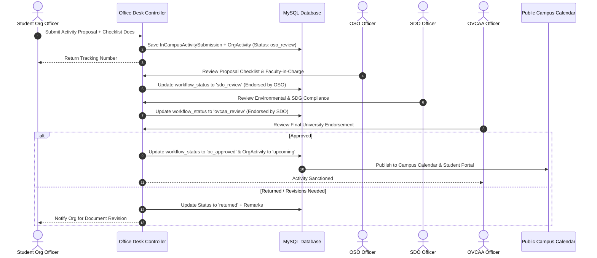
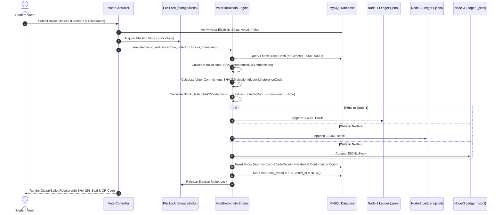
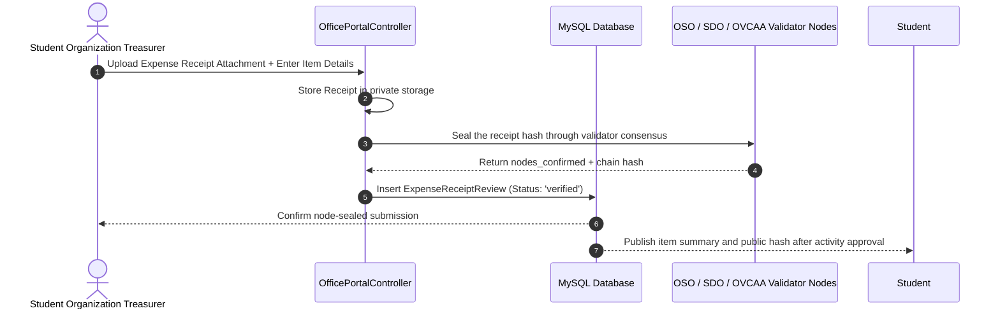

# 🔄 End-to-End Data Flow

> [!abstract] Transaction Sequences
> This document maps out the core data transactions across OrgChain: Activity Proposal Submission & Multi-Tier Review, Ballot Casting & 3-Node Cryptographic Sealing, and Cryptographic Expense Liquidation.

---

## 1. 📋 Activity Proposal Submission & Office Approval Flow

```mermaid
sequenceDiagram
    autonumber
    actor SO as Student Org Officer
    participant OD as Office Desk Controller
    participant DB as MySQL Database
    actor OSO as OSO Officer
    actor SDO as SDO Officer
    actor OVCAA as OVCAA Officer
    participant CAL as Public Campus Calendar

    SO->>OD: Submit Activity Proposal + Checklist Docs
    OD->>DB: Save InCampusActivitySubmission + OrgActivity (Status: oso_review)
    OD-->>SO: Return Tracking Number

    OSO->>OD: Review Proposal Checklist & Faculty-in-Charge
    OD->>DB: Update workflow_status to 'sdo_review' (Endorsed by OSO)

    SDO->>OD: Review Environmental & SDG Compliance
    OD->>DB: Update workflow_status to 'ovcaa_review' (Endorsed by SDO)

    OVCAA->>OD: Review Final University Endorsement
    alt Approved
        OD->>DB: Update workflow_status to 'oc_approved' & OrgActivity to 'upcoming'
        DB->>CAL: Publish to Campus Calendar & Student Portal
        OD-->>OVCAA: Activity Sanctioned
    else Returned / Revisions Needed
        OD->>DB: Update Status to 'returned' + Remarks
        OD-->>SO: Notify Org for Document Revision
    end
```

---

## 2. 🗳️ Ballot Casting & 3-Node VoteChain Sealing Flow

```mermaid
sequenceDiagram
    autonumber
    actor Voter as Student Voter
    participant VC as VoterController
    participant LOCK as File Lock (storage/locks)
    participant BC as VoteBlockchain Engine
    participant DB as MySQL Database
    participant N1 as Node-1 Ledger (.jsonl)
    participant N2 as Node-2 Ledger (.jsonl)
    participant N3 as Node-3 Ledger (.jsonl)

    Voter->>VC: Submit Ballot Choices (Positions & Candidates)
    VC->>DB: Verify Voter Eligibility & has_voted = false
    VC->>LOCK: Acquire Election Mutex Lock (flock)
    
    VC->>BC: seal(electionId, referenceCode, voterId, choices, timestamp)
    BC->>DB: Query Latest Block Hash (or Genesis '0000...0000')
    BC->>BC: Calculate Ballot Root: SHA256(canonical JSON(choices))
    BC->>BC: Calculate Voter Commitment: SHA256(electionId|voterId|referenceCode)
    BC->>BC: Calculate Block Hash: SHA256(electionId + prevHash + ballotRoot + commitment + time)
    
    par Write to Node-1
        BC->>N1: Append JSONL Block
    and Write to Node-2
        BC->>N2: Append JSONL Block
    and Write to Node-3
        BC->>N3: Append JSONL Block
    end

    BC->>DB: Insert Votes (Anonymized) & VoteReceipt (Hashes & Confirmation Count)
    BC->>DB: Mark Voter has_voted = true, voted_at = NOW()
    BC->>LOCK: Release Election Mutex Lock

    VC-->>Voter: Render Digital Ballot Receipt with SHA-256 Seal & QR Code
```

---

## 3. 💰 Budget Liquidation & Expense Sealing Flow

```mermaid
sequenceDiagram
    autonumber
    actor Org as Student Organization Treasurer
    participant OP as OfficePortalController
    participant DB as MySQL Database
    participant NODES as OSO / SDO / OVCAA Validator Nodes

    Org->>OP: Upload Expense Receipt Attachment + Enter Item Details
    OP->>OP: Store Receipt in private storage
    OP->>NODES: Seal the receipt hash through validator consensus
    NODES-->>OP: Return nodes_confirmed + chain hash
    OP->>DB: Insert ExpenseReceiptReview (Status: 'verified')
    DB-->>Org: Confirm node-sealed submission
    DB-->>Student: Publish item summary and public hash after activity approval
```
