# 🏗️ High-Level Technical Architecture

> [!info] Architectural Paradigm
> OrgChain employs a **Modular Monolithic Architecture** on Laravel 13.x and PHP 8.3. It seamlessly bridges modern Eloquent ORM web controllers with a high-performance native PDO Voting Kernel and a localized 3-node cryptographic ledger engine.

---

## 🏢 System Layer Diagram

```mermaid
graph TB
    subgraph PresentationLayer["1. Presentation & Client Interfaces"]
        SP_UI["🎓 Student Portal (Blade + Alpine.js)"]
        OD_UI["🏢 Office Desk (Blade + Custom CSS)"]
        VS_UI["🗳️ Voter Ballot & Receipt View"]
        CAN_UI["📊 SSC Canvassing Live Dashboard"]
    end

    subgraph SecurityLayer["2. Security Guard & Rate Limiting"]
        SG["🛡️ SecurityGuard Engine"]
        RL["⏱️ RateLimiter (Global, Public, Staff)"]
        WAF["🔍 SQL Injection & Scanner Pattern Detector"]
    end

    subgraph ControllerLayer["3. Application & Controller Layer"]
        L_CTRL["Laravel Controllers<br/>(StudentPortal, OfficePortal, CommunityFeed)"]
        V_KERN["Voting System Kernel<br/>(app/VotingSystem/Kernel.php)"]
        V_CTRL["Voting Controllers<br/>(AdminController, VoterController, ApiController)"]
    end

    subgraph DomainLayer["4. Domain Logic & Business Rules"]
        PROP_ENG["📋 Compliance & Proposal Engine"]
        OCR_ENG["🧾 OCR Receipt & Budget Processor"]
        VCHAIN["🔗 VoteBlockchain Cryptographic Engine"]
        NOTIF["📨 Mailer & OTP Service"]
    end

    subgraph DataLayer["5. Persistence & Blockchain Layer"]
        MYSQL[("🗄️ MySQL Database<br/>(Users, Portals, Ballots, Audits)")]
        N1[("📜 VoteChain Node 1<br/>JSONL Ledger")]
        N2[("📜 VoteChain Node 2<br/>JSONL Ledger")]
        N3[("📜 VoteChain Node 3<br/>JSONL Ledger")]
        FS["📁 Storage & Archive Attachments"]
    end

    PresentationLayer --> SecurityLayer
    SecurityLayer --> ControllerLayer
    ControllerLayer --> DomainLayer
    DomainLayer --> DataLayer
```

---

## 🧩 Architectural Subsystem Decomposition

### 1. The Laravel Portal Kernel (`App\Http`)
Handles student authentication, administrative office routing, dynamic form submission for in-campus and off-campus proposals, OCR receipt uploads, document archiving, and social feed interactions.
- **Middlewares**: `EnsureStudentAuthenticated`, `EnsureOfficeAuthenticated`
- **Routing**: `routes/web.php`
- **Views**: `resources/views/org/`, `resources/views/portal/`, `resources/views/office/`

### 2. The Integrated Voting System Kernel (`App\VotingSystem`)
A dedicated, self-contained sub-application embedded under `/voting-system`. It operates with ultra-fast native PDO queries to handle peak election traffic with zero overhead, synchronous file locking, and multi-node ledger commits.
- **Entry Point**: `App\VotingSystem\Kernel::handle()`
- **Routing**: `App\VotingSystem\Core\Router`
- **Controllers**: `AdminController`, `VoterController`, `ApiController`, `MediaController`
- **State Bridge**: Bidirectional session synchronization with Laravel session store.

### 3. The 3-Node VoteChain Engine (`App\VotingSystem\Core\VoteBlockchain`)
A deterministic cryptographic ledger operating 3 redundant append-only JSONL files located in `storage/app/voting/chain/node-{1,2,3}/`.
- Computes SHA-256 ballot roots from voter choices.
- Anonymizes voter identity using SHA-256 voter commitments (`hash(electionId|voterId|referenceCode)`).
- Enforces strict blockchain continuity (`previous_hash -> block_hash`).
