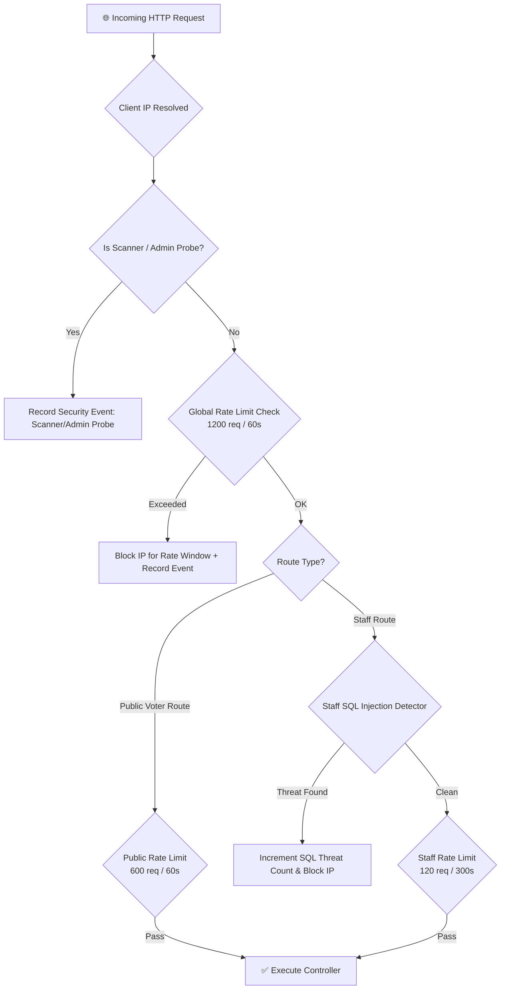

# 🛡️ Security Architecture & Guardrails

> [!danger] Security Imperative
> Because OrgChain governs university fund allocations and student leadership elections, the platform enforces an active defense-in-depth security framework via the internal **SecurityGuard** intrusion detection system (IDS).

---

## 🛡️ SecurityGuard Defense Layers



---

## ⏱️ Rate Limiting Windows & Thresholds

All rate limiting is dynamically enforced in memory and recorded in the database:

| Rate Limiter Pool | Window | Threshold | Trigger Action |
| :--- | :--- | :--- | :--- |
| **Global Request Pool** | 60 seconds | 1,200 requests | HTTP 429 Blocked, Logged as `global_rate_blocked` (`critical`) |
| **Public Voter Pool** | 60 seconds | 600 requests | HTTP 429 Blocked, Logged as `public_voter_rate_blocked` (`high`) |
| **Staff & Admin Pool** | 300 seconds (5 min) | 120 requests | HTTP 429 Blocked, Logged as `staff_rate_blocked` (`high`) |
| **SQL Injection Attempt**| 3,600 seconds (1 hr) | 5 attempts | **Immediate 1-Hour Hard IP Ban**, Logged as `sql_injection_blocked` |

---

## 🔍 SQL Injection Signature Detection Engine

`SecurityGuard::detectSqlInjectionAttempt()` inspects all incoming `$_GET`, `$_POST`, and request payloads against known injection heuristics:

```php
// Active heuristic patterns monitored on Staff and Auth routes:
$patterns = [
    '/union\s+select/i',
    '/select\s+.*\s+from/i',
    '/insert\s+into/i',
    '/drop\s+(table|database)/i',
    '/update\s+.*\s+set/i',
    '/delete\s+from/i',
    '/--\s*$/m',
    '/\/\*.*?\*\//s',
    '/\b(or|and)\b\s+['\"]?\d+['\"]?\s*=\s*['\"]?\d+/i',
    '/\b(or|and)\b\s+['\"]?[a-z0-9_]+['\"]?\s*=\s*['\"]?[a-z0-9_]+/i',
    '/sleep\s*\(\s*\d+\s*\)/i',
    '/benchmark\s*\(/i',
    '/load_file\s*\(/i',
    '/into\s+outfile/i',
    '/into\s+dumpfile/i',
];
```

---

## 🕵️ Obfuscated Staff & Admin Route Protection

To defend against automated bot crawlers and dictionary attacks, administrative entry points are decoupled from standard URLs like `/admin` or `/login`:

```env
# Obfuscated path configurations in .env
OFFICE_LOGIN_PATH=/orgchain-office-access-a9e2f71c4b83
ADMIN_LOGIN_PATH=/ssc-access-c7b4f2e91a6d
CANVASSING_DASHBOARD_PATH=/ssc-canvassing-dashboard-d8f3b72a4e91
CANVASSING_TALLY_PATH=/ssc-canvassing-tally-73a6e2d4b8c9
CANVASSING_REPORTS_PATH=/ssc-canvassing-reports-b61e7a42c9f8
```

> [!warning] Admin Probes
> Any unauthenticated request attempting to probe common administrative routes (e.g., `/wp-admin`, `/phpmyadmin`, `/admin/login`) is intercepted, logged as `scanner_path_probe`, and throttled.
