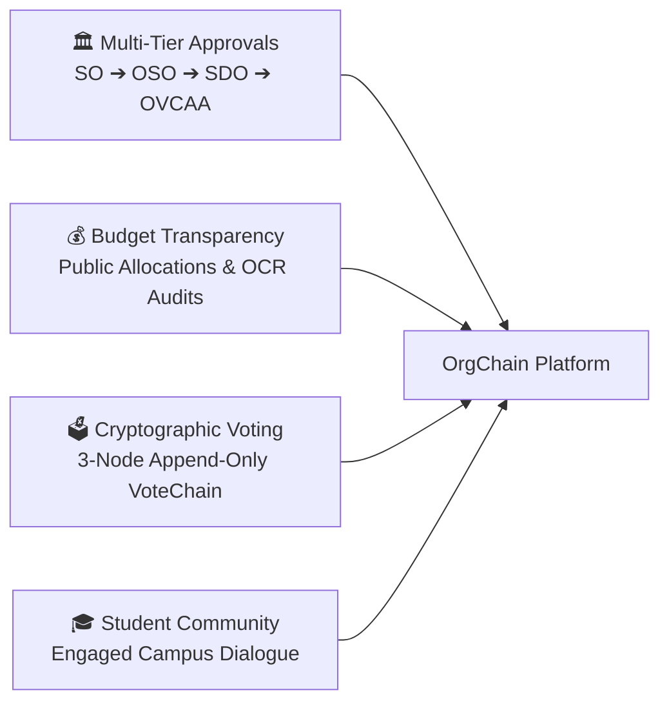
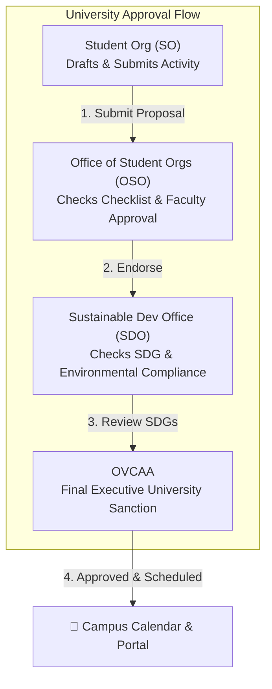

# 🏛️ System Overview & Institutional Vision

> [!abstract] Institutional Context
> **Batangas State University - The National Engineering University (BatStateU)** hosts dozens of recognized student organizations, professional academic societies, and the Supreme Student Council (SSC). Managing physical paper document approvals, tracking fund utilization, and conducting trustworthy student council elections have historically suffered from operational bottlenecks, delayed reviews, and trust deficits.

---

## 🎯 The OrgChain Mission

**OrgChain** was created to establish a single, unified digital governance, transparency, and election framework with four fundamental pillars:

1. **Streamlined Institutional Governance**: Replace paper routing with a 4-tier digital document workflow ([[Multi-Tier Office Roles SO OSO SDO OVCAA]]) that validates compliance checklists in accordance with University and CHED policies.
2. **Transparent Financial Liquidation**: Provide real-time visibility into organization budget allocations and expenditures, backed by OCR receipt auditing ([[Budget Utilization and OCR Receipts]]).
3. **Provable Election Integrity**: Eliminate electoral disputes by securing voter ballots with a 3-node localized blockchain ledger ([[VoteChain Cryptographic Engine]]), ensuring that ballots cannot be modified or deleted without invalidating cryptographic hash seals.
4. **Active Student Engagement**: Connect students to university events through an interactive campus feed ([[Community Feed Posts and Likes]]) and calendar ([[Interactive Activity Calendar]]).

---

## ⚠️ Traditional Pain Points vs. OrgChain Solutions

| Traditional Challenge | OrgChain Solution | Impact |
| :--- | :--- | :--- |
| **Lost or stalled paper endorsements** across multiple administration buildings | Centralized digital submission queue with real-time status badges (`created`, `verification`, `ovcaa_approved`) | Approval turnaround reduced from weeks to days |
| **Opaque student org fund utilization** leading to mistrust | Public portal showing categorized budget items, spent totals, and OCR receipt audits | 100% financial transparency for student fee allocations |
| **Allegations of election tampering** or database manipulation | 3-node JSONL append-only cryptographic ledger with Merkle ballot roots and SHA-256 chain links | Cryptographically verifiable election results with zero ballot tampering |
| **Disjointed campus event awareness** | Unified portal calendar and community feed linking directly to approved proposals | Higher student participation in campus life |

---

## 📐 Governance Model & Stakeholder Hierarchy

See the detailed approval pipeline in [[Activity Proposal Approval Pipeline]].
