# ⚙️ Tech Stack & Dependencies

> [!info] Technology Matrix
> OrgChain is built upon modern, rock-solid, production-tested open-source technologies tailored for speed, reliability, and security.

---

## 🛠️ Core Technology Stack

```mermaid
graph LR
    subgraph Frontend["Frontend Layer"]
        BLADE["Laravel Blade Engine"]
        TW["Tailwind CSS 3.x"]
        ALP["Alpine.js (Interactivity)"]
        VITE["Vite 6.x Bundler"]
    end

    subgraph Backend["Backend & Runtime"]
        PHP["PHP 8.3.x (ZTS / CLI)"]
        LARAVEL["Laravel Framework 13.x"]
        PDO["Native PDO Database Layer"]
        CRYPTO["PHP OpenSSL & Hash Core"]
    end

    subgraph Storage["Data & Ledgers"]
        MYSQL["MySQL 8.0 / MariaDB 10.x"]
        JSONL["Append-Only JSONL Multi-Node"]
        LOCAL_DISK["Laravel Local Filesystem"]
    end

    Frontend --> Backend
    Backend --> Storage
```

---

## 📦 Composer Packages & Requirements

From [`composer.json`](file:///c:/laragon/www/OrgChain/OrgChains/composer.json):

| Package | Version | Purpose |
| :--- | :--- | :--- |
| **`php`** | `^8.3` | Modern PHP engine with strict typing and JIT optimizations |
| **`laravel/framework`** | `^13.8` | Core MVC framework, router, Eloquent ORM, and Blade |
| **`laravel/tinker`** | `^3.0` | Interactive REPL shell for debugging and database querying |
| **`phpunit/phpunit`** | `^12.5` | Unit and integration testing suite |
| **`mockery/mockery`** | `^1.6` | Mock object framework for test isolation |
| **`nunomaduro/collision`** | `^8.6` | CLI error rendering and debugging interface |
| **`laravel/pint`** | `^1.27` | Code style linter and automatic PSR-12 formatter |

---

## 🎨 Node & Frontend Dependencies

From [`package.json`](file:///c:/laragon/www/OrgChain/OrgChains/package.json):

| Package | Version | Purpose |
| :--- | :--- | :--- |
| **`vite`** | `^6.0` | Ultra-fast frontend development server and bundler |
| **`laravel-vite-plugin`**| `^1.2` | Vite bridge for Laravel asset bundling |
| **`tailwindcss`** | `^3.4` | Utility-first CSS framework for clean responsive UI |
| **`postcss`** / **`autoprefixer`** | Latest | CSS post-processing and vendor prefixing |
| **`concurrently`** | Latest | Runs server, queue worker, and Vite watchers in parallel |

---

## 💻 Server Runtime Prerequisites

To run OrgChain in local development or production:
1. **PHP 8.3+** with extensions: `pdo_mysql`, `pdo_sqlite`, `openssl`, `mbstring`, `fileinfo`, `curl`, `gd`, `zip`.
2. **Web Server**: Apache / Nginx / Built-in PHP Development Server (`public/server-router.php`).
3. **Database**: MySQL 8.0+, MariaDB 10.4+, or SQLite 3.35+.
4. **Node.js**: Node 18+ and NPM 9+.
