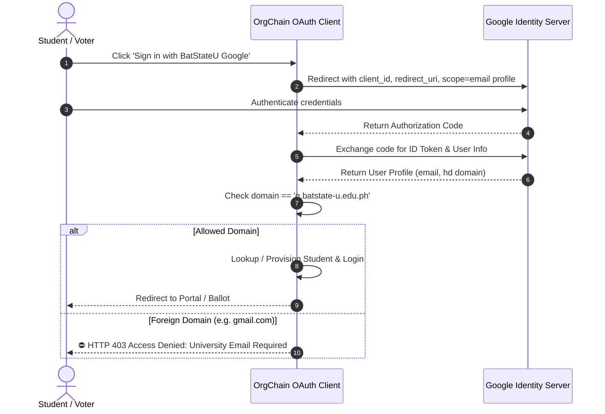

# 🔑 Google OAuth2 & BatStateU Domain Filter

> [!info] Domain Restriction
> To ensure that only legitimate university members participate in voting and student discussions, OrgChain enforces institutional domain filtering on all Google OAuth2 flows.

---

## 🛡️ Domain Enforcement Mechanism

