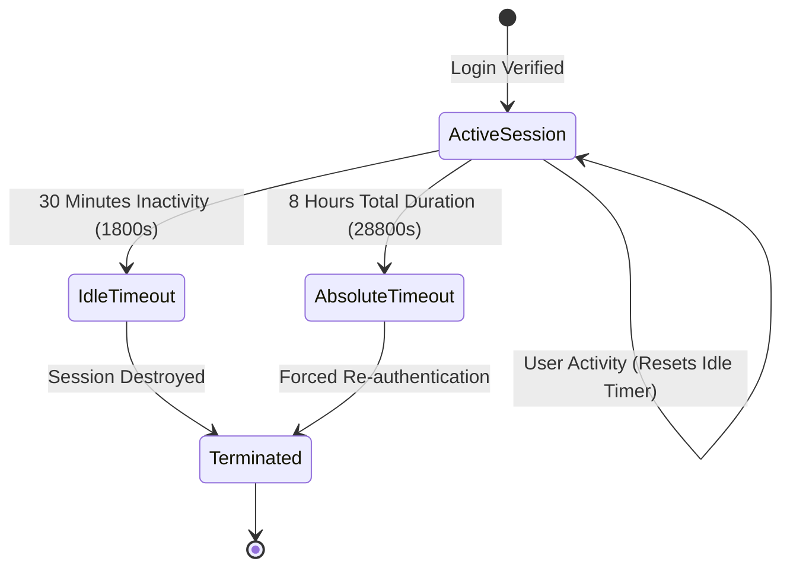

# 🛡️ Session Management & Lifetime Policies

> [!info] Dual-Kernel Session Bridge
> OrgChain bridges standard Laravel HTTP sessions with the standalone native PDO Voting System Kernel to ensure seamless cross-subsystem navigation without session loss.

---

## ⏱️ Session Lifetime Rules

---

## 🔄 The Voting System Session Bridge

Because the Voting System runs under its own fast Kernel (`app/VotingSystem/Kernel.php`), `routes/web.php` executes a bidirectional session synchronization bridge:
1. Synchronizes `session()->all()` into `$_SESSION` before executing `VotingKernel::handle()`.
2. Registers a `register_shutdown_function` to write back any changes from `$_SESSION` back into Laravel's session store before exiting.
3. Automatically shares CSRF tokens across both ecosystems (`_csrf`).
