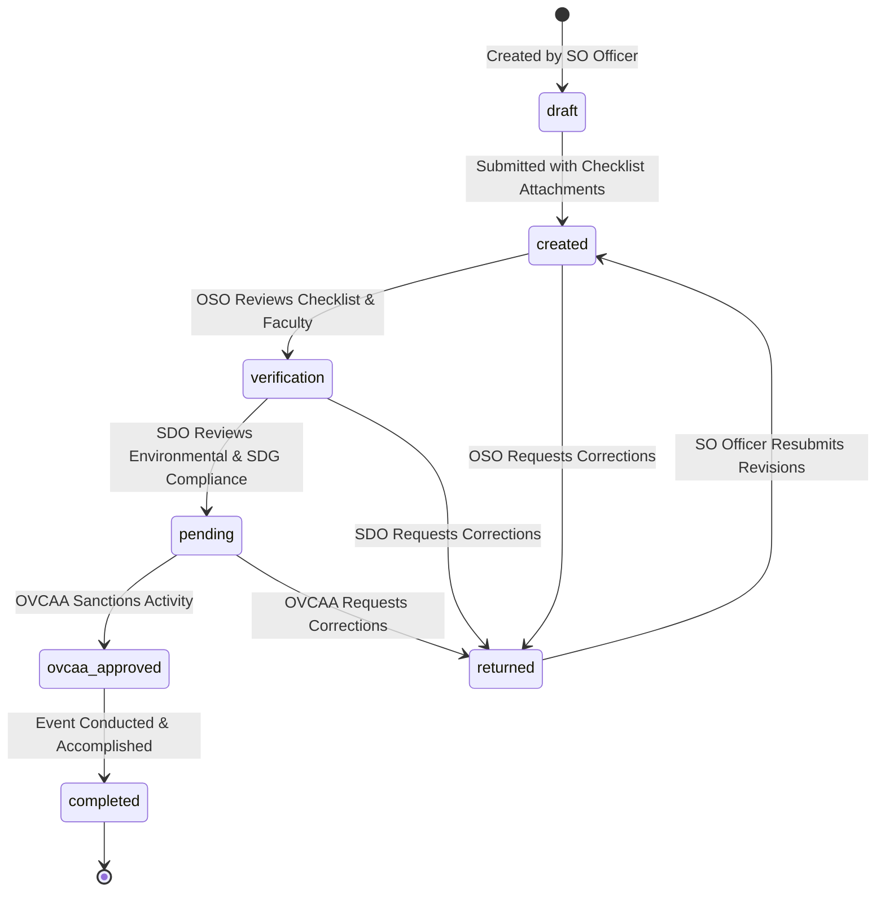

# 📝 Activity Proposal Approval Pipeline

> [!info] Approval Pipeline
> All student activities—whether academic seminars, outreach drives, or sports events—must pass through the multi-stage digital pipeline in [`InCampusActivitySubmission`](file:///c:/laragon/www/OrgChain/OrgChains/app/Models/InCampusActivitySubmission.php).

---

## 🔄 State Machine & Status Progression

---

## 📄 Proposal Document Attachments (JSON Payload)

The `InCampusActivitySubmission` stores all compliance documents within a structured `attachments` JSON column:
1. **Checklist Template**: Completed compliance items.
2. **Project Proposal**: Objectives, background, target audience.
3. **Detailed Programme**: Hourly schedule and speaker roster.
4. **Itemized Budget Proposal**: Allocation requests and financial sources.
5. **Faculty-In-Charge Assignment**: Signed departmental adviser endorsement.
6. **Medical & Insurance Request Letters**: Health protocol and student insurance coverage.
7. **Organization Board Resolution**: Official officer approval minutes.
8. **Waste Policy Compliance Form**: Solid waste management plan.
