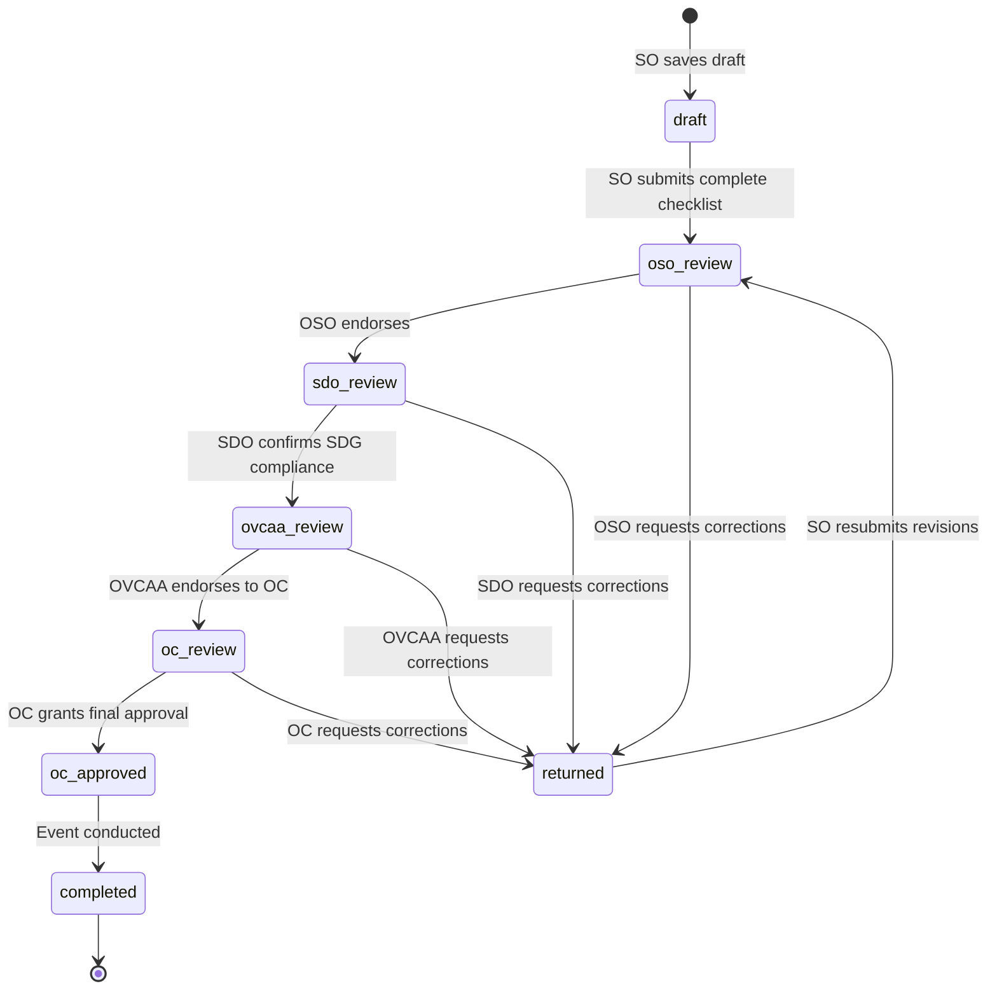

# 📝 Activity Proposal Approval Pipeline

> [!info] Approval Pipeline
> All student activities—whether academic seminars, outreach drives, or sports events—must pass through the server-side digital pipeline in [`InCampusActivitySubmission`](file:///c:/laragon/www/OrgChain/OrgChains/app/Models/InCampusActivitySubmission.php) and its linked `OrgActivity` record.

---

## 🔄 State Machine & Status Progression

```mermaid
stateDiagram-v2
    [*] --> draft: SO saves draft
    draft --> oso_review: SO submits complete checklist
    oso_review --> sdo_review: OSO endorses
    sdo_review --> ovcaa_review: SDO confirms SDG compliance
    ovcaa_review --> oc_review: OVCAA endorses to OC
    oc_review --> oc_approved: OC grants final approval
    oso_review --> returned: OSO requests corrections
    sdo_review --> returned: SDO requests corrections
    ovcaa_review --> returned: OVCAA requests corrections
    oc_review --> returned: OC requests corrections
    returned --> oso_review: SO resubmits revisions
    oc_approved --> completed: Event conducted
    completed --> [*]
```

New SO submissions go directly to OSO. `college_review` remains supported for legacy records and optional college-reviewer endorsements.

---

## 📄 Proposal Document Attachments (JSON Payload)

The `InCampusActivitySubmission` stores all compliance documents within a structured `attachments` JSON column:
1. **Checklist Template**: Completed compliance items.
2. **Project Proposal**: Objectives, background, target audience.
3. **Detailed Programme**: Hourly schedule and speaker roster.
4. **Itemized Budget Proposal**: Allocation requests and financial sources.
5. **Faculty-In-Charge Assignment**: Signed departmental adviser endorsement.
6. **Medical & Insurance Request Letters**: Health protocol and student insurance coverage.
7. **Organization Board Resolution**: Official officer approval minutes.
8. **Waste Policy Compliance Form**: Solid waste management plan.

---

## 🧭 Current Filing Experience (2026-09-20)

The activity form now supports both filing types from the same route:

- `in_campus` — BatStateU in-campus activity requirements.
- `local_off_campus` — local off-campus / CHED compliance requirements.

The selected type changes the visible checklist, official template links, document pack download, and conditional questions without a page reload. The allocated budget is required when an activity is saved, so the activity starts with a real budget baseline instead of a zero placeholder.

### Checklist submission behavior

Current lifecycle update: [[Session Log 2026-09-21 Activity Budget Lifecycle]]. Submitted activities are locked for editing until returned; ended proposals cannot advance. OSO must confirm document review, SDO must save SDGs and assessment notes, OVCAA must endorse the verified package to OC, and only OC final approval checks/reserves organization funds. Historical statements about freely editing submitted/approved proposals no longer apply.

1. **Save draft** stores the activity and any uploaded files already selected without requiring the final checklist files.
2. **Submit for review** validates the required pre-activity uploads for the selected type.
3. Conditional documents are required only when their condition is selected (for example medical, transport, tour operator, or external coordination).
4. During-activity and after-activity records remain available for later upload and do not block the initial filing.
5. Submitted checklist rows are persisted in `activity_compliance_docs` with `pending` review status.

### Official document workflow

The form keeps the official In-Campus and Local Off-Campus templates as file-backed documents. Supported DOCX files can be previewed in the browser; the original file remains the explicit download path. Students complete the official file externally and upload the signed or completed version through the checklist before final submission.

The OSO Updates page uses the same source-backed approach. Its official-template cards now resolve to the supplied files in `In Campus/`, `Local Off Campus/`, `TOSA/`, and `Reports/`, with the file size and modified date read from disk at request time. Legacy demo cards and generated placeholder downloads are no longer used. Legacy `.doc` sources remain downloadable as-is; the supplied WPCF PDF render is used only for its in-page preview.

### OSO document visibility rule (2026-09-21)

The OSO review table treats the stored attachment as the source of truth. A compliance status row without a matching file in `InCampusActivitySubmission.attachments` is not shown as an uploaded document, which prevents seeded or orphan status rows from appearing as approved files. When an activity has multiple submission versions, OSO resolves the `submission_id` on the compliance row first and then searches older versions, so files from an earlier SO edit remain previewable. All preview and download links use the owning submission ID and are emitted only when the file exists on the public storage disk.
