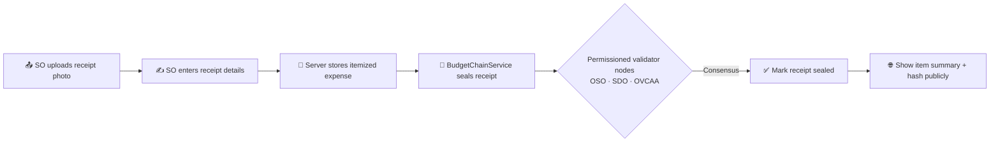

# 💰 Budget Utilization & Receipt Records

> [!important] Standard receipt workflow
> The SO Budget Utilization form is manual and direct: officers upload receipt and invoice attachments (image or PDF), enter the purchase details (merchant, item, unit cost, date, reference number), and submit. OCR scanning is not used in this project per project requirements.

> [!important] Current behavior — 2026-09-21
> [[Session Log 2026-09-21 Activity Budget Lifecycle]] supersedes historical demo, title-linked receipt, automatic audit, and public-storage descriptions below. Approved activities are the authoritative allocation/spending ledger. New receipts are activity-ID linked and private; pending seals already count as recorded expenses but are not shown publicly as confirmed. Approval reserves funds; receipts debit cash once. Semester ZIP exports include original receipts and the register. Fund setup and fund-balance visibility are SO-only; OSO, SDO, and OVCAA monitor activities and expenses without the organization-funds card. Shared SO accounts are not yet organization-isolated.

> [!tip] Current receipt entry behavior — 2026-09-21
> SO can add up to 20 item rows in one submission. One shared upload area accepts up to three receipt/supporting-document files, and each row has only its own quantity, unit cost, merchant, reference number, payment details, and other manual fields. If one receipt contains many items, upload it once and add one row per item. The whole batch remains transactional, so if one row fails validation or exceeds the activity/organization balance, no row is recorded and no balance is changed.

> [!note] SO workspace cleanup — 2026-09-21
> The SO desk now uses a smaller operational surface: Analytics is removed from the SO navigation, the Budget page uses an approved-activity selector instead of a consolidated portfolio selector, fund balances render as mobile-friendly ledger cards, and secondary charts are collapsed until requested. OSO retains the consolidated portfolio filters and monitoring table. “Recorded ledger cash” is a derived system balance, not a live bank or GCash balance. The shared SO account still lacks an organization binding, so organization-level data isolation remains a separate production task.

The semester AR + FR package uses an explicit review lock: after SO submission, upload and resubmit controls disappear for SO. OSO opening either package document records that the package was opened; the package remains locked until OSO returns or accepts it.

> [!abstract] Financial Accountability
> OrgChain records itemized receipt photos, manually entered expense details, server-side budget deductions, and blockchain seals for accountable student-fee utilization.

---

## 🧾 Expense Liquidation & Manual Receipt Recording

---

## 📊 BudgetItem Entity Attributes

From [`BudgetItem`](file:///c:/laragon/www/OrgChain/OrgChains/app/Models/BudgetItem.php):
- `title`: Budget category/activity title (e.g., *Leadership Summit*).
- `category`: `Programs`, `Extension`, `Operations`, `Sports`.
- `allocated`: Total approved budget allocation (PHP).
- `utilized`: Cumulative verified expenses (PHP).
- `fiscal_year`: Fiscal period (e.g., `2026`).

---

## 🔍 Receipt review fields and legacy scan metadata

> The active manual flow intentionally leaves OCR confidence, scan IDs, and OCR corrections empty. These columns remain in the database only so older scanner-generated records and compatibility endpoints can still be read safely.

From [`ExpenseReceiptReview`](file:///c:/laragon/www/OrgChain/OrgChains/app/Models/ExpenseReceiptReview.php):
- `activity_title`: Event associated with the expense.
- `item_name`: Purchased item or service.
- `unit_cost`: Verified monetary amount.
- `ocr_confidence`: Text recognition certainty percentage (0-100%).
- `student_confirmed`: Boolean flag confirming student officer verified the parsed data.
- `verification_status`: `pending_seal` immediately after the atomic batch write, then `verified` after node consensus; `approved` is retained only for legacy rows.

## 🧾 Shared receipt upload and itemized entry

- The active SO form uploads one shared receipt/supporting-document set (`receipts[]`, maximum three files) before the item list. It previews each selected file locally and supports JPG, PNG, WebP, and PDF attachments up to 5 MB each.
- The first item row and every **Add item** row contain manual fields only. A receipt containing many purchases is handled by adding one input row per item; the same uploaded receipt set is reused for every row.
- The final server-side `recordMany()` call stores one `ExpenseReceiptReview` per item row and one quantity × unit-cost debit per row. Shared files are stored once and de-duplicated in receipt history and ZIP exports.
- The active path does not scan or classify the uploaded file. OCR/DOCX compatibility code is only reachable when an older client explicitly provides `receipt_scan_id`.
- Receipt history, financial compilation, ZIP export, and the blockchain seal remain itemized because each manual row is stored as its own receipt record.

---

## 🔗 Budget utilization on permissioned chain (2026-09-18)

When an SO expense receipt is submitted, OrgChain seals a utilization block via `BudgetChainService`. OSO, SDO, and OVCAA participate as validator nodes; they do not manually approve individual receipts:

- Ledgers: `storage/app/orgchain/budget/node-{1,2,3}/budget.jsonl` (3-node append, VoteChain-style)
- Receipt row stores `chain_hash`, `previous_hash`, `nodes_confirmed`, and is marked `verified` after consensus
- Office **Budget Utilization** page shows recent sealed blocks
- Student portal surfaces the same seals for public transparency → [[Transparency and Budget Visibility]]

Related: [[Organization Renewal Filing Window]] (separate org recognition flow)

---

## 🗄️ Live database read-back (2026-09-19)

The Budget Utilization page no longer runs on a hardcoded demo dataset. `OfficePortalController@budget` builds the full page dataset from the database via `buildLiveBudgetDataset()`:

- **Sources**: `org_activities` (budgets, scope, venue, workflow) + `budget_items` (per-category allocated/utilized, grouped by org + scope) + `expense_receipt_reviews` (itemized expenses, documents, timeline) + `BudgetChainService::recentBlocks()` (hashes, seals)
- **Activity selector** lists the real encoded activities + a consolidated portfolio entry; stepper stage and rate status derive from `workflow_status` and utilization rate
- **Approval gate**: only activities with final `oc_approved` workflow status are listed; no demo activity fallback is shown
- **SO-only upload**: `office.budget.receipts.store` rejects OSO, SDO, and OVCAA requests; the upload is sealed and marked `verified` after node consensus
- Recording an expense (camera/upload → `office.budget.receipts.store`) reappears in the expense table, documents, and timeline on next load

## 🥧 Expense Breakdown scope split (2026-09-19)

The donut answers *where the money went* with exactly **2 slices** — In-Campus vs Off-Campus — computed live from `budget_items.utilized` grouped by `scope` (`buildLiveBudgetDataset()` → `scopeTotals`, rendered by `scopeSplit()`). Per-activity line items (Equipment, Food, Sports…) live in the Budget-vs-Actual bar chart and the Expense Details table instead.

## 📎 Receipt file viewing (2026-09-19)

- `GET /office-desk/budget-utilization/receipts/{review}/view` → `OfficePortalController@viewReceipt` (`office.budget.receipts.view`) serves the stored receipt file (`expense-receipts/*` on the private `local` disk, 404 when missing)
- Expense-table **View** buttons and Supporting-Document buttons open the real file in a new tab whenever the row has a sealed receipt; demo rows without one keep the explanatory popup

## 🧹 Receipt upload state safety (2026-09-21)

- The SO receipt form now clears a photo and preview restored by a browser reload or back/forward cache. A restored browser file is not treated as a new user upload.
- The upload status and submit state return to **No receipt selected** until the SO chooses the photo again.
- This is client-side lifecycle protection; it does not delete any stored receipt record.

## 🔎 Manual receipt photo guidance (2026-09-21)

- Upload a clear, complete receipt photo showing the purchase information needed for the manual fields.
- The form checks the selected photo type and size before submission; it does not interpret the image or claim that the receipt is authentic.
- Receipt type and payment method may remain unknown when the paper receipt does not print them; the SO can select the appropriate value manually.

## 📅 Approved activity period alignment (2026-09-21)

- The SO Budget Utilization selector is now limited to final-approved activities in the selected academic year/semester.
- The default activity is selected from that same period. A July 2026 activity is treated as A.Y. 2025–2026 Midyear, not A.Y. 2026–2027.
- Opening a deep link for an activity from another academic year redirects to that activity's correct annual period instead of showing a false zero-budget/no-matching-records state.

## 🖼️ Shared receipts with many item rows (2026-09-21)

- The shared uploader accepts up to three receipt/supporting-document files and shows a thumbnail or PDF card for each one, with individual removal before submit.
- If one receipt lists ten purchased items, upload it once and add ten manual item rows. Every row points to the same stored attachment set, so the SO does not have to re-upload or duplicate the receipt.
- `expense_receipt_reviews.receipt_attachments` stores the private-file manifest while `receipt_path` and `receipt_name` remain compatibility fields. The authenticated view, Receipt History, and ZIP register expose the files and every item mapping.
