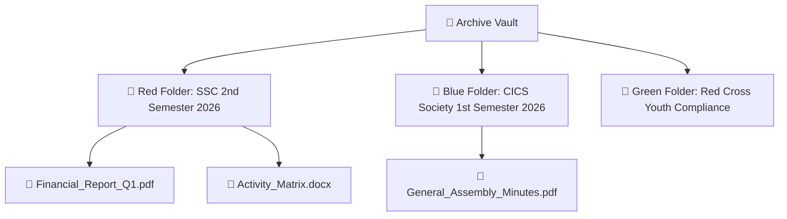

# 📂 Document Archive & Compliance Repository

> [!abstract] Digital Document Vault
> The OrgChain Archive module (`/office-desk/archive`) provides a multi-semester document management system organized by student organization, semester, and color-coded folders.

---

## 🗂️ Folder & Document Architecture

---

## 💾 Storage & File Integrity

All uploaded documents are stored securely on the local filesystem:
- **Physical Path**: `storage/app/public/archive_documents/`
- **Database Table**: `archive_documents` (`file_path`, `mime_type`, `file_size`, `uploaded_by`)
- **Folder Table**: `archive_folders` (`name`, `organization_name`, `semester`, `color`)
