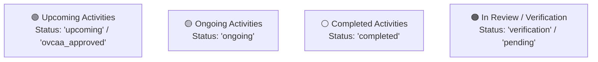

# 📅 Interactive Activity Calendar

> [!info] Campus Calendar
> The interactive calendar at `/office-desk/calendar` aggregates all approved and upcoming activities across university organizations, preventing venue conflicts and schedule overlaps.

---

## 🎨 Calendar Status Color Codes

---

## 🗓️ Dynamic Month Filtering

The calendar controller dynamically parses query parameters `?month=YYYY-MM`:
- Calculates monthly event densities.
- Maps multi-day activities (`starts_at` to `ends_at`).
- Links each calendar event directly to its detailed proposal and budget sheets.
