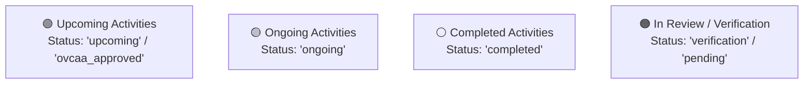

# 📅 Interactive Activity Calendar

> [!info] Campus Calendar
> The interactive calendar at `/office-desk/calendar` aggregates all approved and upcoming activities across university organizations, preventing venue conflicts and schedule overlaps.

---

## 🎨 Calendar Status Color Codes

```mermaid
graph TD
    UP["🟢 Upcoming Activities<br/>Status: 'upcoming' / 'ovcaa_approved'"]
    ON["🟡 Ongoing Activities<br/>Status: 'ongoing'"]
    COMP["⚪ Completed Activities<br/>Status: 'completed'"]
    PEND["🟠 In Review / Verification<br/>Status: 'verification' / 'pending'"]
```

---

## 🗓️ Dynamic Month Filtering

The calendar controller dynamically parses query parameters `?month=YYYY-MM`:
- Calculates monthly event densities.
- Maps multi-day activities (`starts_at` to `ends_at`).
- Links each calendar event directly to its detailed proposal and budget sheets.

---

## ⚡ No-reload month navigation (2026-09-19)

The ‹ › arrows fetch the target month in the background and swap only the grid, month title, upcoming list, and events JSON (`loadMonth()` in `calendar.blade.php`), then `pushState` the URL. Grid dims while loading; any fetch failure falls back to a full page load. Back/forward triggers a reload to keep state consistent.

## 🪟 Schedule detail modal (2026-09-19)

Clicking a day cell (or an Upcoming item) opens a viewport-centered `<dialog>` (`position:fixed; inset:0; margin:auto`):
- **1 event** → full details immediately (status, date, time, venue, notes, link to Activities)
- **Multiple events** → pick-list with a "← All that day" back button
- **Empty day** → "No activities on this day"
- The old selected-day card below the calendar was removed; empty months no longer 500 (null-safe default-day fallback)
