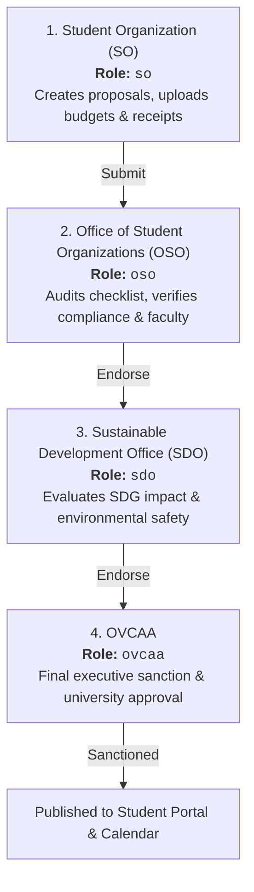

# 🏛️ Multi-Tier Office Roles (SO, OSO, SDO, OVCAA)

> [!abstract] Governance Hierarchy
> The OrgChain Administrative Desk (`/office-desk`) is structured around BatStateU's 4-tier institutional review chain for student organizations.

---

## 👥 The 4 Administrative Tiers

---

## 📋 Role Responsibilities Matrix

| Office Role | Code | Primary Responsibilities | Can Approve Stages |
| :--- | :--- | :--- | :--- |
| **Student Organization** | `so` | Draft proposals, manage members, submit OCR expense receipts, organize folder archives | Draft submissions only |
| **Office of Student Orgs** | `oso` | Verify institutional checklist, audit faculty-in-charge assignments, review budget items | `created` ➔ `verification` |
| **Sustainable Dev Office** | `sdo` | Audit environmental compliance, waste management policies, and UN SDG mappings | `verification` ➔ `pending` |
| **OVCAA Executive** | `ovcaa` | Final university executive review, sanction official student activities | `pending` ➔ `ovcaa_approved` |

---

## 🎨 Role-Based Branding & Context Badges

Each office user sees tailored navigation headers and badge counters generated by `OfficePortalController::deskContext()`:
- **Brand Title & Seal**: Automatically tailored to the officer's specific department.
- **Financial Review Counter (`fr_attachments`)**: Unreviewed budget receipts pending audit.
- **Accomplishment Report Counter (`ar_attachments`)**: Completed activities requiring post-event liquidation.
