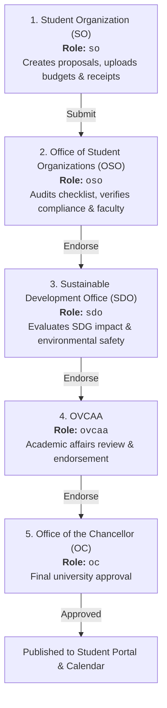

# 🏛️ Multi-Tier Office Roles (SO, OSO, SDO, OVCAA, OC)

> [!abstract] Governance Hierarchy
> The OrgChain Administrative Desk (`/office-desk`) is structured around BatStateU's staged institutional review chain for student organizations. OVCAA reviews and endorses; the Office of the Chancellor (OC) records final approval.

---

## 👥 The Administrative Desks

```mermaid
graph TD
    SO["1. Student Organization (SO)<br/><b>Role:</b> <code>so</code><br/>Creates proposals, uploads budgets & receipts"]
    OSO["2. Office of Student Organizations (OSO)<br/><b>Role:</b> <code>oso</code><br/>Audits checklist, verifies compliance & faculty"]
    SDO["3. Sustainable Development Office (SDO)<br/><b>Role:</b> <code>sdo</code><br/>Evaluates SDG impact & environmental safety"]
    OVCAA["4. OVCAA<br/><b>Role:</b> <code>ovcaa</code><br/>Academic affairs review & endorsement"]
    OC["5. Office of the Chancellor (OC)<br/><b>Role:</b> <code>oc</code><br/>Final university approval"]

    SO -->|Submit| OSO
    OSO -->|Endorse| SDO
    SDO -->|Endorse| OVCAA
    OVCAA -->|Endorse| OC
    OC -->|Approved| Published[Published to Student Portal & Calendar]
```

---

## 📋 Role Responsibilities Matrix

| Office Role | Code | Primary Responsibilities | Can Approve Stages |
| :--- | :--- | :--- | :--- |
| **Student Organization** | `so` | Draft proposals, manage members, stage the paired AR + FR semester package, submit expense receipts | Draft submissions and report preparation |
| **Office of Student Orgs** | `oso` | Verify institutional checklist, audit faculty-in-charge assignments, review activities, make the final AR + FR report decision, and archive accepted packages | Activity endorsement plus AR + FR return/accept |
| **Sustainable Dev Office** | `sdo` | Audit environmental compliance, waste management policies, and UN SDG mappings | Activity SDG review only |
| **OVCAA Review Desk** | `ovcaa` | Review SDO-verified packages and endorse the complete activity record to OC | OVCAA review only |
| **Office of the Chancellor** | `oc` | Review the complete activity package and record the final university decision | Final activity approval only |

---

## 🎨 Role-Based Branding & Context Badges

Each office user sees tailored navigation headers and badge counters generated by `OfficePortalController::deskContext()`:
- **Brand Title & Seal**: Automatically tailored to the officer's specific department.
- **Semester report navigation**: Financial Report and Accomplishment Report are rendered only for `so` and `oso`.
- **SDO / OVCAA / OC boundary**: These desks do not receive AR/FR badges or dashboard report metrics, and direct report page/file requests return `403`.
- **OSO-only review**: AR + FR are submitted as one end-of-semester package; OSO returns or accepts the pair and creates the archive record on acceptance.
