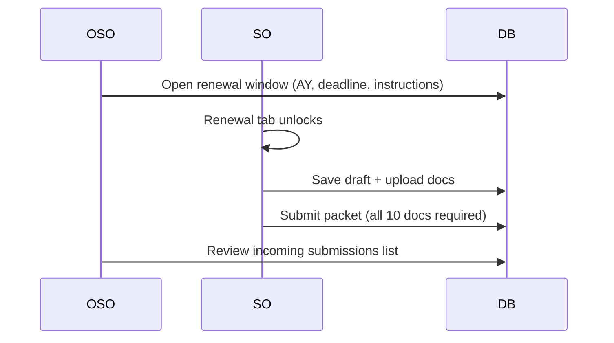

# Organization Renewal (SO ↔ OSO)

> [!summary] Design
> **OSO owns the filing window.** SO only sees an unlocked Renewal tab when OSO opens filing. This matches campus practice (seasonal recognition) and keeps setup off the SO desk.

## Access

| Role | Nav | Capabilities |
| :--- | :--- | :--- |
| **OSO** | Renewal (sliders badge) | Open/close window, AY/semester, instructions, view incoming packets |
| **SO** | Renewal (lock badge) | When open: draft org details, pick Adviser/Dean names, upload 10 docs, submit |
| **SDO / OVCAA** | Hidden | Direct `/office-desk/renewal` → **403** |

**URL:** `/office-desk/renewal` · Route names: `office.renewal`, `office.renewal.window`, `office.renewal.submit`, `office.renewal.documents`

## Default required documents (10)

1. Commitment Letter of the Adviser  
2. Certification of Academic Qualifications  
3. Profile of Student Organization  
4. List of Members  
5. History of Student Organization  
6. Declaration of the Organization Revolving Fund  
7. Ratified Constitution and By-Law  
8. Student Organization Adviser and Officers Profile  
9. Plan of Activities  
10. Specimen Signature  

## Data model

- [[Model - OrgRenewalWindow Submission Document]]
- Tables: `org_renewal_windows`, `org_renewal_submissions`, `org_renewal_documents`
- Migration: `2026_09_18_140000_create_org_renewal_tables.php`

## Flow (current)

## Not built yet (next)

- Real Adviser / Dean login roles and approve/comment steps  
- Hard recognition status after OSO final approval  
- Controller `abort` on Archive/TOSA for non-OSO (nav-only gate today)

## Related

- [[Multi-Tier Office Roles SO OSO SDO OVCAA]]
- [[Web and Portal Route Map]]
- [[Playwright Console Smoke Testing]]
- Source of truth for process narrative: Student Org Renewal & Monitoring System (Adviser → Dean → OSO)
