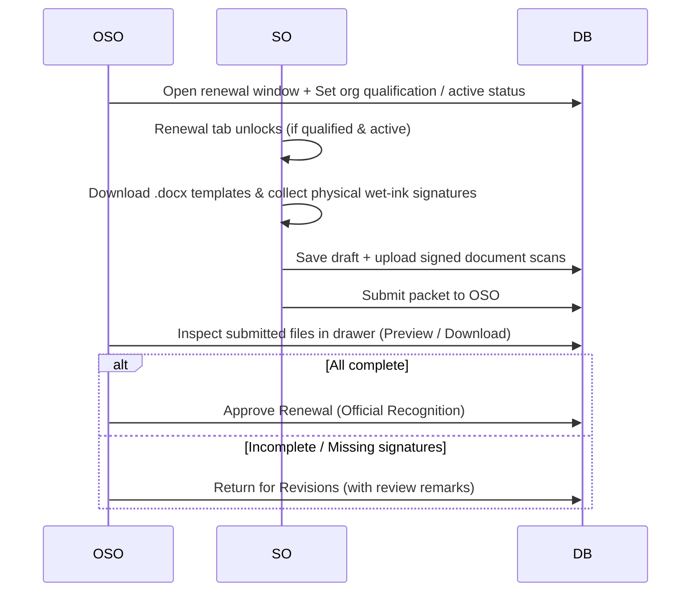

# Organization Renewal (SO ↔ OSO)

> [!summary] Design
> **OSO owns the filing window.** SO only sees an unlocked Renewal tab when OSO opens filing. This matches campus practice (seasonal recognition) and keeps setup off the SO desk.

## Access

| Role | Nav | Capabilities |
| :--- | :--- | :--- |
| **OSO** | Renewal (sliders badge) | Open/close window, AY/semester, set requirements, monitor 32 org qualifications & active status with reasons, inspect incoming packets via drawer, approve or return |
| **SO** | Renewal (lock badge) | When open & qualified: draft org details, download official .docx templates, upload 10 signed documents, submit packet |
| **SDO / OVCAA** | Hidden | Direct `/office-desk/renewal` → **403** |

**URL:** `/office-desk/renewal` · Route names: `office.renewal`, `office.renewal.window`, `office.renewal.submit`, `office.renewal.documents`, `office.renewal.review`, `office.renewal.organization.status`

## Organization Eligibility & Qualification Monitor (OSO)

OSO maintains institutional control over all 32 student organizations across BatStateU ARASOF-Nasugbu:
- **Operational Status**: Toggle between **Active** and **Inactive / Dormant** (for clubs undergoing charter revision or lacking an active council).
- **Renewal Qualification**: Mark as **Qualified to Renew** (cleared) or **Not Qualified** (blocked from submitting).
- **Disqualification Reason Presets**:
  - *Unliquidated Financial Report (FR) — pending year-end liquidation clearance.*
  - *Incomplete Accomplishment Report (AR) — missing required activity documentation.*
  - *Inactive organization — no active executive council roster filed.*
  - *Dormant club — undergoing charter revision and faculty adviser re-assignment.*
  - *Pending disciplinary clearance or administrative review.*
- **Student Desk Enforcement**: Disqualified or inactive organizations see an immediate red warning banner detailing the OSO deficiency reason, and the "Submit Packet to OSO" button is locked.

## Physical Wet-Ink Signing & Scan Upload Workflow (Data Privacy Compliant)

In compliance with **Republic Act 10173 (Data Privacy Act of 2012)** and university accreditation standards:
1. **Download Official Template (.docx)**: Student leaders download the clean university template for each requirement.
2. **Edit Locally in Microsoft Word**: Officers type in council member rosters, activity plans, and constitution details in Word without formatting corruption.
3. **Print & Collect Physical Signatures**: Hardcopies are signed with authentic wet-ink signatures by the Student President, Faculty Adviser, and College Dean.
4. **Scan & Upload**: Scanned copies (PDF, PNG, JPG) or documents are uploaded back into OrgChain.
5. **In-Browser Review (OSO)**: OSO coordinators expand the **"Inspect Submitted Documents"** drawer to view scanned signatures directly in the browser modal viewer or download files, and proceed with **Approve Renewal** or **Return for Revisions**.

## Official Recognition Documents (10 Requirements + Master Form)

- **Master Institutional Application**: `BatStateU-FO-SOA-01` Application for Recognition / Renewal of Student Organization (Rev. 03)
- **Attachment A**: Commitment Letter of the Adviser  
- **Attachment B**: Certification of Academic Qualifications  
- **Attachment C**: Profile of Student Organization  
- **Attachment D**: List of Members  
- **Attachment E**: History of Student Organization  
- **Attachment F**: Declaration of the Organization Revolving Fund  
- **Attachment G**: Ratified Constitution and By-Laws  
- **Attachment H**: Student Organization Adviser and Officers Profile  
- **Attachment I**: Plan of Activities  
- **Attachment J**: Specimen Signatures  

## Data model

- [[Model - OrgRenewalWindow Submission Document]]
- Tables: `org_renewal_windows`, `org_renewal_submissions`, `org_renewal_documents`, `student_organizations`
- Migrations: `2026_09_18_140000_create_org_renewal_tables.php`, `2026_10_04_000001_add_renewal_qualification_fields_to_student_organizations_table.php`

## Flow (current)

```mermaid
sequenceDiagram
  participant OSO
  participant SO
  participant DB
  OSO->>DB: Open renewal window + Set org qualification / active status
  SO->>SO: Renewal tab unlocks (if qualified & active)
  SO->>SO: Download .docx templates & collect physical wet-ink signatures
  SO->>DB: Save draft + upload signed document scans
  SO->>DB: Submit packet to OSO
  OSO->>DB: Inspect submitted files in drawer (Preview / Download)
  alt All complete
    OSO->>DB: Approve Renewal (Official Recognition)
  else Incomplete / Missing signatures
    OSO->>DB: Return for Revisions (with review remarks)
  end
```

## Related

- [[Known Limitations and Technical Debt]]
- [[Multi-Tier Office Roles SO OSO SDO OVCAA]]
- [[Web and Portal Route Map]]
- [[Playwright Console Smoke Testing]]

