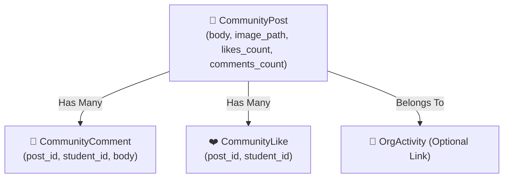

# 💬 Community Feed, Posts & Likes

> [!info] Campus Dialogue
> The Student Community Feed (`/portal/community`) provides a forum where students can discuss campus events, share project highlights, and comment on organizational achievements.

---

## 📱 Social Interaction Components

---

## ⚡ Real-Time Post & Like Features

- **Activity Tagging**: Posts can be tagged with official university activities (`org_activities`).
- **Optimistic Like Toggle**: Toggle like status instantly with responsive counters.
- **Threaded Commenting**: Direct student-to-student discussions linked to verified student profiles.
