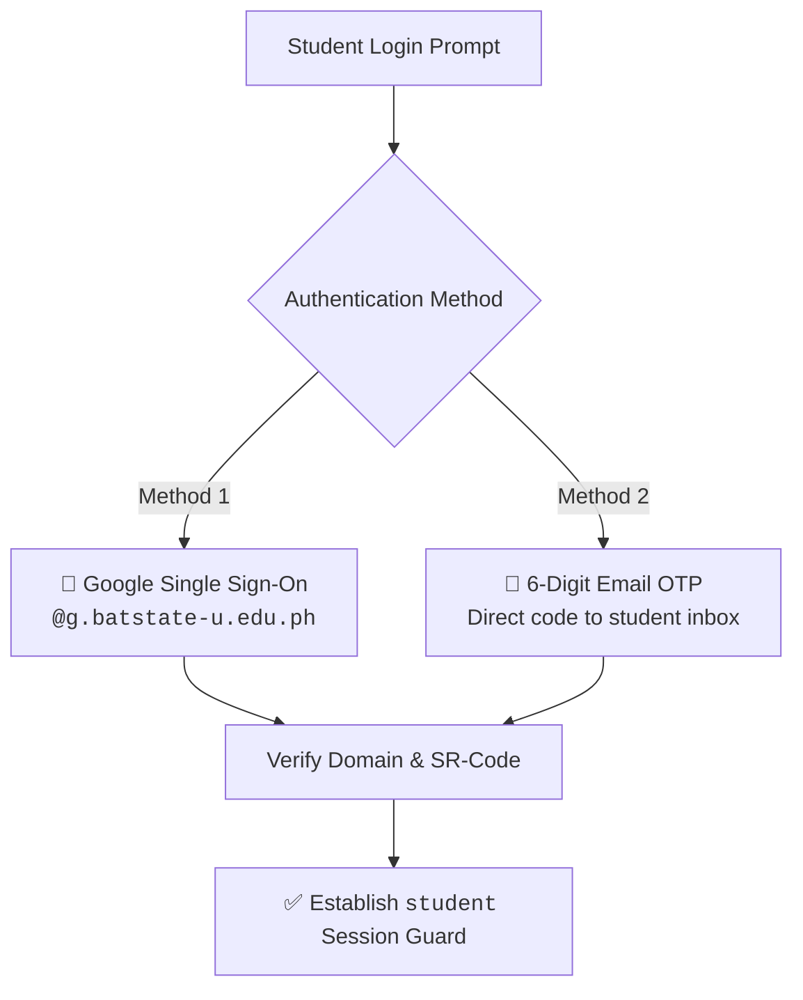

# 👤 Student Profile & Authentication

> [!abstract] Student Identity
> In OrgChain, each student is identified by their unique university **SR-Code** (e.g. `21-00001`) and verified university Google Workspace account (`@g.batstate-u.edu.ph`).

---

## 🆔 Student Identity Schema

From [`Student`](file:///c:/laragon/www/OrgChain/OrgChains/app/Models/Student.php) & [`UserAccount`](file:///c:/laragon/www/OrgChain/OrgChains/app/Models/UserAccount.php):
- `sr_code`: Unique student identification string (e.g., `21-00001`).
- `name`: Full student name.
- `email`: Institutional email address.
- `college`: Academic college (e.g., *College of Informatics and Computing Sciences*).
- `program`: Degree program (e.g., *BS Information Technology*).
- `year_level`: Current academic year (e.g., *4th Year*).
- `is_active`: Account status flag.

---

## 🔐 Dual Authentication Pathways

