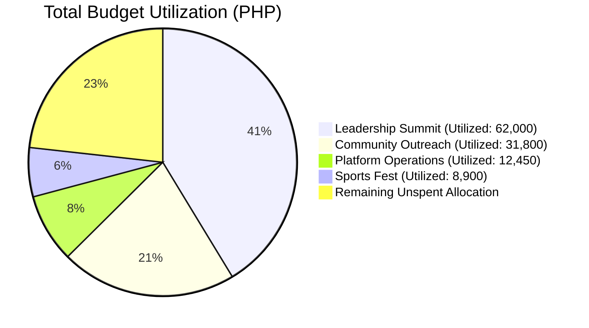

# 📈 Transparency & Budget Visibility

> [!abstract] Public Accountability
> OrgChain empowers every student to inspect how student organization funds are being spent in real time via the Student Portal dashboard (`/portal`).

---

## 📊 Portal Budget Visualizer

---

## 🔍 Publicly Accessible Metrics:
1. **Total Allocated vs. Total Utilized Fund Gauges**.
2. **Itemized Program Expenses** with description notes and fiscal year markers.
3. **Upcoming vs. Completed Activity Tracking**.
