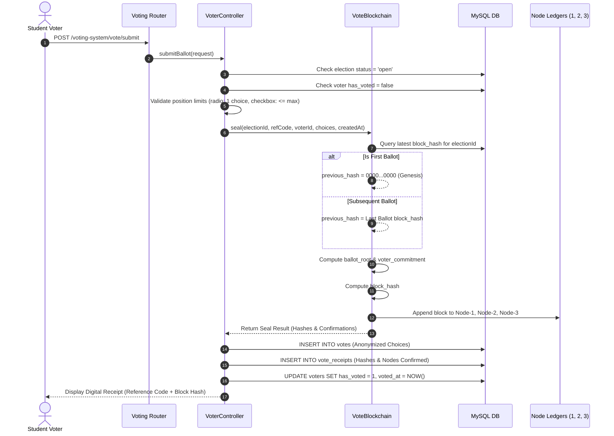

# 🧾 Ballot Sealing & Hash Chaining

> [!info] Sealing Pipeline
> Ballot sealing is the cryptographic process of transforming a voter's candidate selections into an immutable blockchain record with a tamper-evident digital receipt.

---

## 🔄 Detailed Sealing Lifecycle



---

## 🧾 Voter Digital Receipt Attributes

Upon successful ballot sealing, the voter receives a cryptographic receipt containing:
- **Reference Code**: Unique identifier (e.g., `VOTE-8B41D9EA02`)
- **Sealed Block Hash**: 64-character hexadecimal SHA-256 fingerprint
- **Ballot Root**: Merkle root of their validated choices
- **Nodes Confirmed**: Confirmation count across the 3 independent ledgers (`3/3 Nodes Verified`)
- **QR Code & Verification URL**: Link to verify receipt integrity at `/voting-system/admin/chain-verify`

```text
=====================================================
          ORGCHAIN OFFICIAL BALLOT RECEIPT
=====================================================
Reference Code:    VOTE-8B41D9EA02
Election ID:       1 (SSC General Elections 2026)
Timestamp:         2026-08-20 15:35:12
Previous Hash:     9c8e17094b219084c0128741b2094719...
Block Hash:        a1b2c3d4e5f60718293a4b5c6d7e8f90...
Ballot Root:       5e884898da28047151d0e56f8dc62927...
Nodes Confirmed:   3 / 3 Synchronized
=====================================================
```
