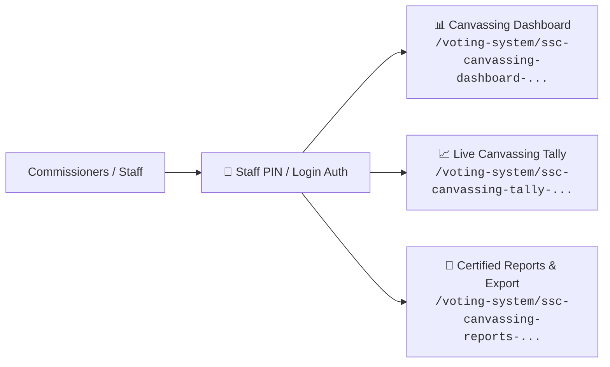

# 📊 Real-Time Canvassing & Tally

> [!info] Canvassing Overview
> The Supreme Student Council (SSC) Canvassing Desk provides real-time ballot aggregation, voter turnout tracking, cryptographic verification checks, and printable certified canvassing reports.

---

## 🖥️ Canvassing Desk Interfaces



---

## 📈 Tally Aggregation Logic

Votes are computed in real time directly from the `votes` table:

```sql
SELECT 
    p.id AS position_id,
    p.title AS position_title,
    p.max_choices,
    c.id AS candidate_id,
    c.name AS candidate_name,
    c.party,
    COUNT(v.id) as total_votes
FROM positions p
JOIN candidates c ON c.position_id = p.id
LEFT JOIN votes v ON v.candidate_id = c.id AND v.position_id = p.id
WHERE p.election_id = :election_id
GROUP BY p.id, p.title, p.max_choices, c.id, c.name, c.party
ORDER BY p.sort_order ASC, total_votes DESC;
```

---

## 🔐 PIN-Protected Certified Reports

To export or print official canvassing summaries, staff must enter the `CANVASSING_REPORTS_PIN` defined in `.env`.

### Features of the Certified Canvassing Report:
1. **Total Registered Voters vs Actual Turnout Percentage**.
2. **Turnout Breakdown by College and Program**.
3. **Candidate Rankings with Vote Percentages**.
4. **Blockchain Integrity Status Stamp** (Total Sealed Blocks, Broken Links = 0).
5. **Formal Signature Blocks** for the SSC Chairperson, Faculty Adviser, and Dean of Student Affairs.
