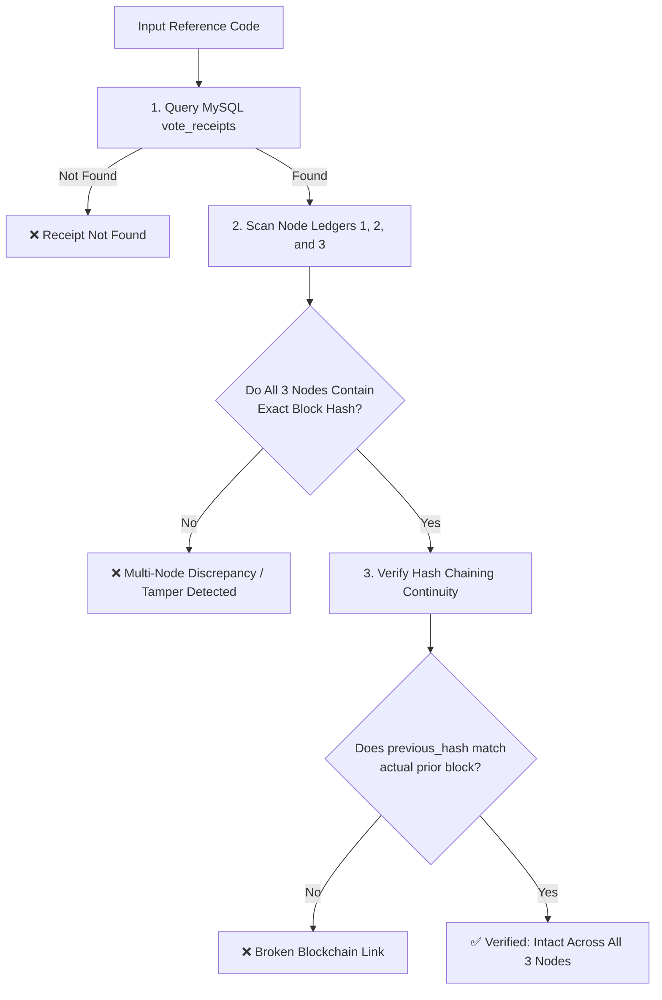

# 🔍 Receipt Verification & Audit

> [!abstract] Proof of Integrity
> Any student voter or election commissioner can cryptographically audit their ballot receipt using the public/admin verification interface at `/voting-system/admin/chain-verify`.

---

## 🔬 Multi-Vector Integrity Verification Algorithm

`VoteBlockchain::verify($referenceCode)` executes a 3-step cryptographic audit:



---

## 🔍 Verification Response Payload Structure

```json
{
  "ok": true,
  "message": "Ballot seal verified across all 3 nodes. Hash link is intact.",
  "receipt": {
    "reference_code": "VOTE-8B41D9EA02",
    "block_hash": "a1b2c3d4e5f60718293a4b5c6d7e8f90...",
    "previous_hash": "9c8e17094b219084c0128741b2094719...",
    "ballot_root": "5e884898da28047151d0e56f8dc62927...",
    "nodes_confirmed": 3
  },
  "nodes": [
    {"node": 1, "status": "ok", "block_hash": "a1b2c3..."},
    {"node": 2, "status": "ok", "block_hash": "a1b2c3..."},
    {"node": 3, "status": "ok", "block_hash": "a1b2c3..."}
  ],
  "nodes_matched": 3,
  "hash_link_ok": true
}
```

---

## 🚨 Tamper Detection Capabilities

| Attack Vector | What Happens | Detected By |
| :--- | :--- | :--- |
| **Direct MySQL Record Modification** | Hacker changes `candidate_id` in `votes` table | Ballot Root recalculation mismatch against ledger block |
| **Deleting a Ballot in MySQL** | Receipt missing or gaps in blockchain index | `hash_link_ok = false` (broken chain link) |
| **Tampering with a Node Ledger file** | Hacker edits JSON on Node 1 | Node consensus mismatch (`nodes_matched < 3`) |
| **Inserting Fake Ballot** | Block hash does not link to previous hash | Chain continuity check fails |
