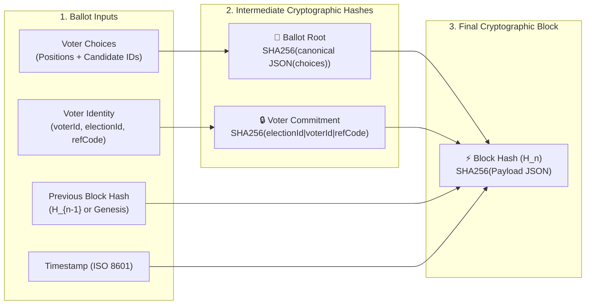

# 📦 VoteChain Cryptographic Engine

> [!abstract] Cryptographic Blueprint
> **VoteChain** is an append-only, tamper-evident cryptographic blockchain engine implemented in [`App\VotingSystem\Core\VoteBlockchain`](file:///c:/laragon/www/OrgChain/OrgChains/app/VotingSystem/Core/VoteBlockchain.php). Designed to guarantee election immutability on a single institutional server, it combines SHA-256 block hashing, Merkle ballot roots, anonymous voter commitments, and 3-node synchronous redundancy.

---

## 🧮 Mathematical & Hashing Specifications



---

## 1. Genesis Block Hash
The first block of any election ledger is anchored to the 64-character zero string:
$$	ext{Genesis Hash} = 	ext{0000000000000000000000000000000000000000000000000000000000000000}$$

## 2. Ballot Root Formula
For any submitted ballot choices array $\mathcal{C} = [c_1, c_2, \dots, c_k]$:
$$	ext{Ballot Root} = 	ext{SHA-256}(	ext{json\_encode}(	ext{ksort}(\mathcal{C})))$$

## 3. Voter Commitment Formula
To ensure **voter anonymity** while preserving **uniqueness**, the voter's identity is cryptographically blinded:
$$	ext{Voter Commitment} = 	ext{SHA-256}(	ext{election\_id} \mathbin{\Vert} 	ext{voter\_id} \mathbin{\Vert} 	ext{reference\_code})$$
> [!tip] Anonymity Guarantee
> Even if an attacker inspects the public ledger or MySQL database, they cannot reverse the voter commitment to determine which candidate a specific student voted for.

## 4. Block Hash Formula
$$	ext{Block Hash} = 	ext{SHA-256}(	ext{json\_encode}(\{ 	ext{election\_id}, 	ext{reference\_code}, 	ext{voter\_commitment}, 	ext{ballot\_root}, 	ext{created\_at}, 	ext{previous\_hash} \}))$$

---

## 📜 Ledger Block JSON Schema

Each sealed ballot is appended as an independent line in JSON Lines (`.jsonl`) format:

```json
{
  "index": 142,
  "election_id": 1,
  "reference_code": "VOTE-66AE8F19B2",
  "previous_hash": "a4f2098b1e42a98f12c8b093de58471201948bc5419823ec1938571249bce192",
  "block_hash": "9c8e17094b219084c0128741b209471928374192837491823749128374192837",
  "ballot_root": "5e884898da28047151d0e56f8dc6292773603d0d6aabbdd62a11ef721d1542d8",
  "voter_commitment": "4b227777d4dd1fc61c6f884f48641d02b4d121d3fd328cb08b5531fcacdabf8a",
  "created_at": "2026-08-20 15:30:00",
  "sealed_at": "2026-08-20T15:30:00+08:00"
}
```

---

## 🔐 Mutex Concurrency & Lock Management

To prevent race conditions during high-volume campus elections, `VoteBlockchain` acquires an exclusive file lock (`flock`) per election:

```php
private function acquireElectionLock(int $electionId)
{
    $lockDir = storage_path('app/voting/locks');
    $lockFile = $lockDir . DIRECTORY_SEPARATOR . "election-{$electionId}.lock";
    $handle = fopen($lockFile, 'c+');
    flock($handle, LOCK_EX); // Blocks until previous block sealing finishes
    return $handle;
}
```
