# 🗄️ Database Schema & Entity-Relationship Diagram (ERD)

> [!abstract] Relational Data Model
> The OrgChain database integrates election management, student records, multi-tier proposal submissions, OCR expense auditing, document archiving, and security forensics.

---

## 🗺️ Master Entity-Relationship Diagram

```mermaid
erDiagram
    %% Core Users & Roles
    OFFICE_USERS {
        bigint id PK
        string name
        string email UK
        string username UK
        string password
        string office_role "so | oso | sdo | ovcaa"
        string office_title
        boolean is_active
    }

    STUDENTS {
        bigint id PK
        string sr_code UK
        string name
        string email UK
        string password
        string college
        string program
        string year_level
        boolean is_active
    }

    ADMIN_USERS {
        bigint id PK
        string name
        string email UK
        string password_hash
        string role "admin | canvassing | view_only"
        boolean is_active
    }

    %% Voting System & VoteChain
    ELECTIONS ||--o{ POSITIONS : has
    POSITIONS ||--o{ CANDIDATES : contains
    ELECTIONS ||--o{ VOTES : receives
    VOTERS ||--o{ VOTES : casts
    ELECTIONS ||--o{ VOTE_RECEIPTS : generates
    VOTERS ||--o{ VOTE_RECEIPTS : receives

    ELECTIONS {
        bigint id PK
        string title
        string status "pending | open | closed"
        datetime start_at
        datetime end_at
    }

    POSITIONS {
        bigint id PK
        bigint election_id FK
        string title
        string selection_type "radio | checkbox"
        int max_choices
        int sort_order
    }

    CANDIDATES {
        bigint id PK
        bigint position_id FK
        string name
        string party
        string image_path
        int sort_order
    }

    VOTERS {
        bigint id PK
        string sr_code UK
        string email
        string full_name
        string college
        boolean has_voted
        datetime voted_at
    }

    VOTE_RECEIPTS {
        bigint id PK
        bigint election_id FK
        bigint voter_id FK
        string reference_code UK
        string previous_hash
        string block_hash
        string ballot_root
        string voter_commitment
        tinyint nodes_confirmed
        json node_confirmations
        datetime created_at
    }

    %% Activities & Approvals
    ORG_ACTIVITIES ||--o{ IN_CAMPUS_SUBMISSIONS : tracks
    ORG_ACTIVITIES ||--o{ COMMUNITY_POSTS : references

    ORG_ACTIVITIES {
        bigint id PK
        string title
        text description
        string status "upcoming | ongoing | completed"
        datetime starts_at
        datetime ends_at
    }

    IN_CAMPUS_SUBMISSIONS {
        bigint id PK
        bigint org_activity_id FK
        string status "draft | created | verification | pending | ovcaa_approved | returned"
        string activity_type
        string organization_name
        json attachments
        timestamp submitted_at
    }

    %% Budget & OCR
    BUDGET_ITEMS {
        bigint id PK
        string title
        string category
        bigint allocated
        bigint utilized
        string fiscal_year
    }

    EXPENSE_RECEIPT_REVIEWS {
        bigint id PK
        string activity_title
        string item_name
        decimal unit_cost
        date expense_date
        string receipt_path
        tinyint ocr_confidence
        boolean student_confirmed
        string verification_status
    }

    %% Social Community
    STUDENTS ||--o{ COMMUNITY_POSTS : authors
    STUDENTS ||--o{ COMMUNITY_COMMENTS : writes
    STUDENTS ||--o{ COMMUNITY_LIKES : toggles
    COMMUNITY_POSTS ||--o{ COMMUNITY_COMMENTS : contains
    COMMUNITY_POSTS ||--o{ COMMUNITY_LIKES : receives

    COMMUNITY_POSTS {
        bigint id PK
        bigint student_id FK
        bigint activity_id FK
        text body
        string image_path
        int likes_count
        int comments_count
    }

    %% Archive Vault
    ARCHIVE_FOLDERS ||--o{ ARCHIVE_DOCUMENTS : contains
    ARCHIVE_FOLDERS {
        bigint id PK
        string name
        string organization_name
        string semester
        string color
    }
    ARCHIVE_DOCUMENTS {
        bigint id PK
        bigint archive_folder_id FK
        string name
        string file_path
        string mime_type
        bigint file_size
    }
```

