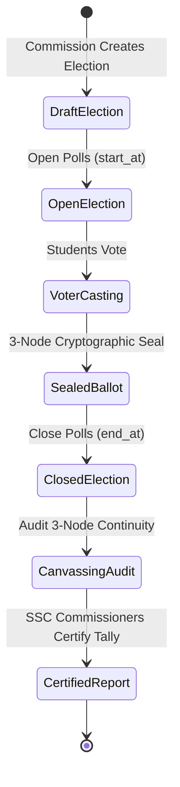

# 🗳️ Election Lifecycle & Tallying Flow

```mermaid
stateDiagram-v2
    [*] --> DraftElection: Commission Creates Election
    DraftElection --> OpenElection: Open Polls (start_at)
    OpenElection --> VoterCasting: Students Vote
    VoterCasting --> SealedBallot: 3-Node Cryptographic Seal
    SealedBallot --> ClosedElection: Close Polls (end_at)
    ClosedElection --> CanvassingAudit: Audit 3-Node Continuity
    CanvassingAudit --> CertifiedReport: SSC Commissioners Certify Tally
    CertifiedReport --> [*]
```
