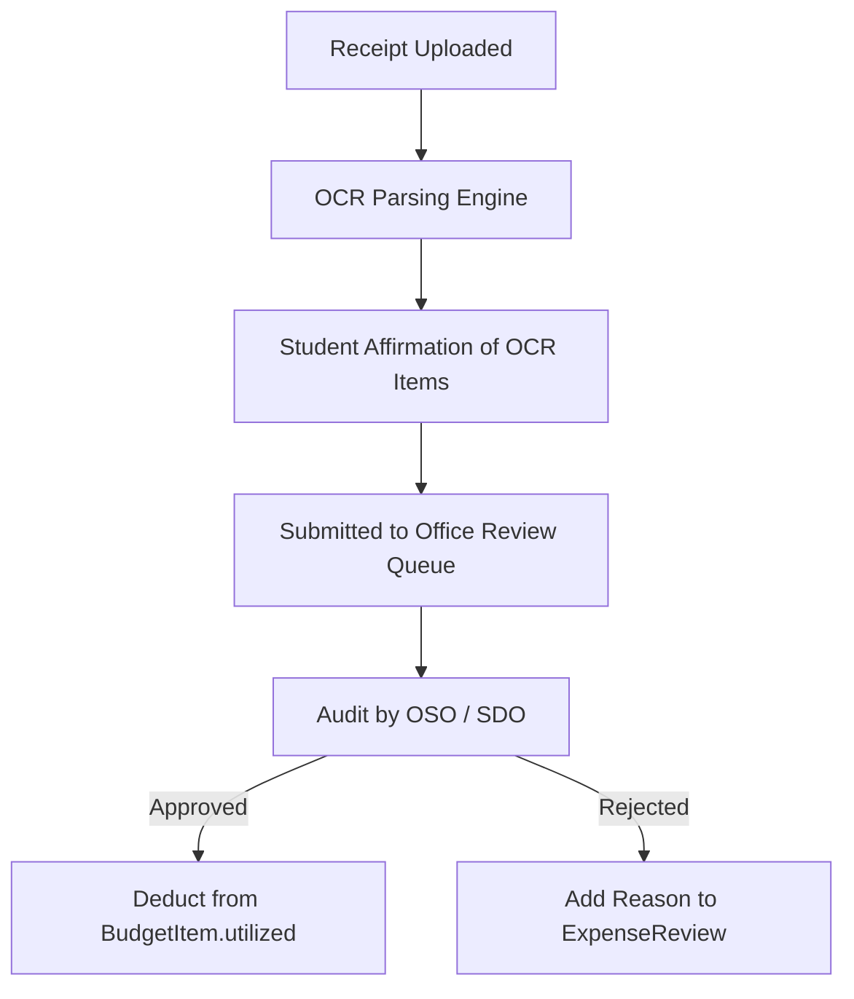

# 🧾 Expense Review & Financial Liquidation Flow

```mermaid
flowchart TD
    RECEIPT[Receipt Uploaded] --> OCR[OCR Parsing Engine]
    OCR --> REVIEW[Student Affirmation of OCR Items]
    REVIEW --> QUEUE[Submitted to Office Review Queue]
    QUEUE --> AUDITOR[Audit by OSO / SDO]
    AUDITOR -- Approved --> DEDUCT[Deduct from BudgetItem.utilized]
    AUDITOR -- Rejected --> NOTE[Add Reason to ExpenseReview]
```
