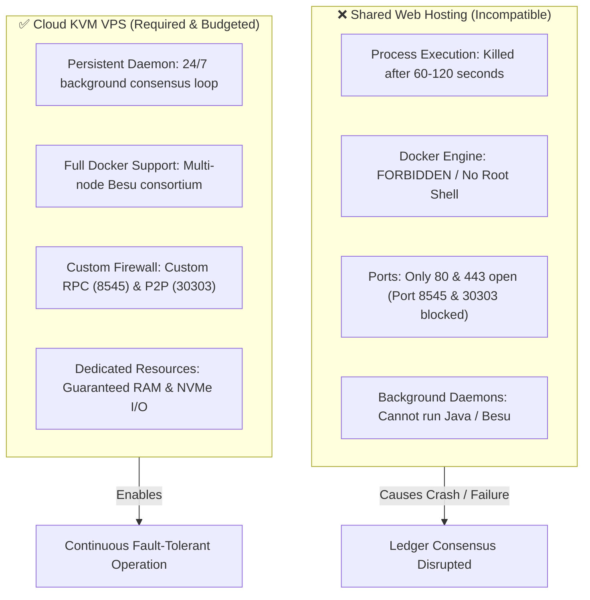

# 💰 Estimated Deployment and Infrastructure Costing (Table II)

> [!abstract] Overview
> This document details the annual operational expenditure (OPEX) and infrastructure budget for **OrgChain: Blockchain-Backed Student Organization & Financial Governance Platform** at **Batangas State University - The National Engineering University (ARASOF-Nasugbu Campus)**.
> 
> Standard shared web hosting was evaluated and determined to be technically infeasible due to process termination limits, lack of containerization, and blocked socket ports. OrgChain strictly provisions a **Linux Kernel-based Virtual Machine (KVM) VPS** to host the Laravel core, MySQL database, and Hyperledger Besu multi-node private blockchain.

---

## 📊 Table II. Estimated Deployment and Infrastructure Costing for OrgChain

| Deployment Item | Technical Specifications & Allocation | Term / Period | Estimated Cost (PHP) |
| :--- | :--- | :--- | :---: |
| **Cloud Virtual Private Server (Hostinger KVM VPS Plan)** | • **OS:** Ubuntu 22.04 LTS (64-bit) • **Compute:** 2 to 4 vCPU Cores, 8 GB RAM, 100 GB NVMe SSD • **Container Engine:** Docker & Docker Compose • **Web / Database:** Nginx, PHP 8.2+, MySQL 8.0 Community • **Blockchain:** Hyperledger Besu Private QBFT Consortium Nodes | 1 Year *(Jan – Dec 2027)* | **₱7,200.00** <small>(~₱600/month)</small> |
| **Domain Name Registration** | Dedicated top-level domain (`.com` / `.org`) or BatStateU ICT institutional subdomain routing (`orgchain.batstate-u.edu.ph`) with DNS Management & WHOIS Privacy. | 1 Year *(Jan – Dec 2027)* | **₱800.00** |
| **SSL / TLS Security Certificate** | Automated 256-bit TLS/SSL certificate encryption via Let's Encrypt / Certbot protocol across all portals and API endpoints. | Auto-renewing | **FREE** <small>(Open Source)</small> |
| **Hyperledger Besu Enterprise Blockchain** | Enterprise Ethereum permissioned consortium client (Linux Foundation). Zero gas fees (`gas_price = 0`), unlimited voting & expense audit ledger transactions. | Perpetual License | **FREE** <small>(Apache 2.0)</small> |
| **TOTAL ESTIMATED COST** | **Covers complete production hosting, domain routing, and unlimited blockchain transactions for one full operational year.** | **1 Year** | **PHP 8,000.00** <small>*(Budget Range: ₱7,388 – ₱8,800)*</small> |

---

## 🔍 Market Rate Validation (Hostinger Philippines VPS)

A review of Hostinger’s official Philippine VPS hosting rates confirms the following price tiers:

1. **Hostinger KVM 2 Plan (Recommended Baseline):**
   - **Specs:** 2 vCPU cores, 8 GB RAM, 100 GB NVMe disk storage, 8 TB bandwidth.
   - **Cost:** ~₱549.00/month on introductory subscription periods $\rightarrow$ standard annual allocation between **₱6,588.00 and ₱7,200.00/year**.
   - **Capacity:** Reliably supports the full OrgChain stack: Laravel backend, MySQL database, and local Besu Docker nodes under standard campus load.

2. **Hostinger KVM 4 Plan (Upper-Tier Scale):**
   - **Specs:** 4 vCPU cores, 16 GB RAM, 200 GB NVMe disk storage, 16 TB bandwidth.
   - **Cost:** ~₱749.00/month $\rightarrow$ approximately **₱8,988.00/year**.
   - **Capacity:** Recommended if validators are distributed across multiple campus departments or during concurrent university-wide supreme student council elections.

3. **Domain Name Registration:**
   - Standard commercial TLD (`.com` or `.org`): **₱650.00 – ₱800.00/year**.
   - University Institutional Subdomain (e.g., `orgchain.batstate-u.edu.ph` via ICT Services Office): **₱0.00 (Zero incremental cost)**.

---

## ⚖️ Architectural Justification: Why VPS is Mandatory (vs. Shared Hosting)

> [!danger] Why Shared Hosting Fails for OrgChain
> Traditional shared web hosting (cPanel "Business Web Hosting") was **eliminated from the deployment architecture** because it cannot support the background runtime requirements of an enterprise blockchain.

1. **Persistent Daemon Lifecycles:**
   - Shared hosting web servers (Apache/LiteSpeed) kill execution threads after 60 to 120 seconds.
   - Hyperledger Besu validator nodes must run continuously 24 hours a day, 7 days a week to receive blocks, participate in QBFT round-robin proposing, and verify cryptographic state roots.
2. **Containerization Engine (Docker & Docker Compose):**
   - OrgChain bundles its multi-validator blockchain network into Docker containers.
   - Shared hosting environments strictly forbid Docker daemon execution and do not provide root shell (`sudo`) access.
3. **Custom Port Listening & P2P Networking:**
   - Shared hosts block all incoming ports other than 80 and 443.
   - Hyperledger Besu requires port `8545` for JSON-RPC API client requests and port `30303` for validator discovery and block synchronization.

---

## ⛓️ Enterprise Blockchain Economics: Why Hyperledger Besu is 100% Free

> [!tip] Zero-Gas Enterprise Architecture
> Hyperledger Besu operates at zero licensing cost and zero transaction overhead under the following architecture:

1. **Linux Foundation Open-Source Governance:**
   - Hyperledger Besu is an enterprise-grade Ethereum client governed by the **Linux Foundation** and released under the **Apache 2.0 license**.
   - It has no proprietary per-seat licenses, user limits, or corporate subscription paywalls.
2. **Zero-Gas Consensus (`gas_price = 0`):**
   - Public networks (Ethereum, Polygon) charge "gas" in volatile cryptocurrency to incentivize anonymous public miners.
   - OrgChain operates a **private permissioned consortium network** using **QBFT (Quorum Byzantine Fault Tolerance)**. In the network's `genesis.json`, the minimum gas price is configured to `0`.
   - Every student vote cast and financial audit voucher anchored costs **₱0.00**.
3. **Data Privacy Act of 2012 (RA 10173) Compliance:**
   - Public blockchains expose student voting timestamps and financial disbursement hashes to the open public internet.
   - Running Hyperledger Besu on an internal VPS ensures the distributed ledger remains strictly within the university’s administrative control and jurisdiction.

