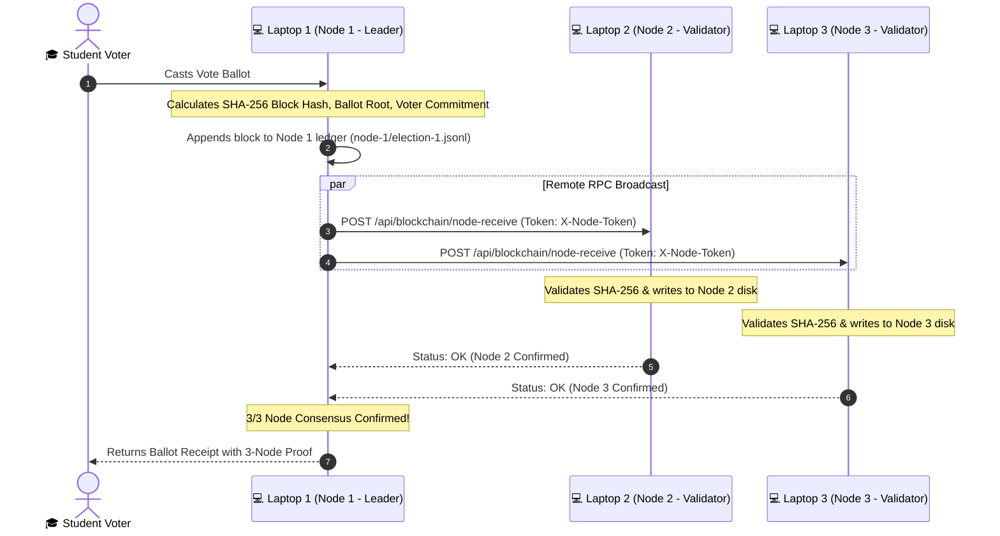

# 🔗 Multi-Laptop 3-Node Blockchain Setup Runbook

> [!abstract] Overview
> OrgChain implements a **Private Consortium Multi-Node Blockchain**. Each of the 3 laptops functions as an independent node validator holding its own append-only JSONL ledger (`election-1.jsonl`). When a ballot is sealed on Laptop 1, the block payload is broadcasted in real time via authenticated RPC to Laptop 2 and Laptop 3 over a local network or the internet.

---

## 🏛️ Node Roles and Topology



---

## ⚙️ Prerequisites & Tool Installation

### 1. Install Cloudflare Tunnel (`cloudflared`)
If `cloudflared` is not yet installed on your machine, run in PowerShell:
```powershell
winget install Cloudflare.cloudflared
```
> [!IMPORTANT]
> Close and reopen PowerShell after installing so that the `cloudflared` command is added to your environment `PATH`.

---

## 🚀 Step-by-Step Multi-Laptop Configuration

### 💻 Laptop 2: Validator Node 2 (Auditor Desk)

1. Clone or pull the repository on Laptop 2:
   ```powershell
   git clone https://github.com/chals1029/OrgChainProject.git
   cd OrgChainProject
   composer install
   npm install
   npm run build
   cp .env.example .env
   php artisan key:generate
   ```

2. In Laptop 2's `.env`, configure:
   ```env
   BLOCKCHAIN_CURRENT_NODE=2
   BLOCKCHAIN_NODE_SECRET=orgchain-node-auth-secret-2026
   ```

3. Start the application server in Terminal 1:
   ```powershell
   php artisan serve --port=8000
   ```

4. In Terminal 2, start Cloudflare Tunnel:
   ```powershell
   cloudflared tunnel --url http://localhost:8000
   ```
   *Cloudflare will output a public URL, for example:*
   `https://reuters-accompanied-tuesday-implementation.trycloudflare.com`
   👉 **Copy and send this URL to Laptop 1.**

---

### 💻 Laptop 3: Validator Node 3 (Kiosk / Secondary Auditor)

1. Clone or pull the repository on Laptop 3:
   ```powershell
   git clone https://github.com/chals1029/OrgChainProject.git
   cd OrgChainProject
   composer install
   npm install
   npm run build
   cp .env.example .env
   php artisan key:generate
   ```

2. In Laptop 3's `.env`, configure:
   ```env
   BLOCKCHAIN_CURRENT_NODE=3
   BLOCKCHAIN_NODE_SECRET=orgchain-node-auth-secret-2026
   ```

3. Start the application server in Terminal 1:
   ```powershell
   php artisan serve --port=8000
   ```

4. In Terminal 2, start Cloudflare Tunnel:
   ```powershell
   cloudflared tunnel --url http://localhost:8000
   ```
   *Cloudflare will output a public URL, for example:*
   `https://cherry-lemon-green-example.trycloudflare.com`
   👉 **Copy and send this URL to Laptop 1.**

---

### 💻 Laptop 1: Primary Leader Node (Database + Ingestion Server)

1. In Laptop 1's `.env`, paste the generated URLs from Laptop 2 and Laptop 3:
   ```env
   BLOCKCHAIN_CURRENT_NODE=1
   BLOCKCHAIN_NODE_SECRET=orgchain-node-auth-secret-2026
   BLOCKCHAIN_NODE_TIMEOUT=5

   BLOCKCHAIN_NODE_1_URL=local
   BLOCKCHAIN_NODE_2_URL=https://reuters-accompanied-tuesday-implementation.trycloudflare.com
   BLOCKCHAIN_NODE_3_URL=https://cherry-lemon-green-example.trycloudflare.com
   ```

2. Start the primary server on Laptop 1:
   ```powershell
   php artisan serve --host=0.0.0.0 --port=8000
   ```

---

## 🗄️ Database Setup & Import Guide

The project includes a ready-to-use UTF-8 SQL dump in `database/sql_dumps/`:
* `database/sql_dumps/orgchain_full_database_dump.sql` (Contains both `votingsystem` and `orgchain` databases).

### How to Import on Laptop 2 & Laptop 3:
* **Option A (Laragon HeidiSQL - Easiest):**
  1. Click **Database** in Laragon $\rightarrow$ Click **Open**.
  2. Go to **File** $\rightarrow$ **Load SQL file...** $\rightarrow$ select `orgchain_full_database_dump.sql`.
  3. Press **F9** to execute.
* **Option B (XAMPP Shell):**
  ```powershell
  mysql -u root < "database/sql_dumps/orgchain_full_database_dump.sql"
  ```
* **Option C (Laravel Built-in Fresh Seed):**
  ```powershell
  php artisan migrate:fresh --seed
  ```

---

## 🔍 Verification & Demonstration Runbook

### 1. Live Ballot Sealing
- Submit a vote on **Laptop 1** (or from any connected voter station).
- The voter receipt displays the SHA-256 block hash and confirmations (`nodes_confirmed: 3`).

### 2. Physical File Verification on All 3 Laptops
Inspect the local ledger file on each machine:
- **Laptop 1:** `storage/app/voting/chain/node-1/election-1.jsonl`
- **Laptop 2:** `storage/app/voting/chain/node-2/election-1.jsonl`
- **Laptop 3:** `storage/app/voting/chain/node-3/election-1.jsonl`

All 3 files will contain identical, cryptographically chained block entries in real time!

### 3. API Node Verification Endpoint
Query the verification API on Laptop 1:
```text
GET http://localhost:8000/voting-system/api/blockchain/verify?reference=VOTE-XXXXXX
```
Response:
```json
{
  "api_version": "1.0",
  "result": {
    "ok": true,
    "message": "Ballot seal verified across all 3 nodes. Hash link is intact.",
    "nodes_matched": 3,
    "hash_link_ok": true
  }
}
```

---

## 🇵🇭 Gabay sa Taglish (Quick Reference para sa Team)

1. **Laptop 2 at Laptop 3**:
   - I-run: `git pull origin main`
   - I-set sa `.env` ang `BLOCKCHAIN_CURRENT_NODE=2` (Laptop 2) o `BLOCKCHAIN_CURRENT_NODE=3` (Laptop 3).
   - I-run: `php artisan serve --port=8000`
   - I-run sa 2nd terminal: `cloudflared tunnel --url http://localhost:8000`
   - I-send ang lumabas na `https://...trycloudflare.com` URL kay Laptop 1.
2. **Laptop 1**:
   - Ilagay sa `.env` ang mga natanggap na link sa `BLOCKCHAIN_NODE_2_URL` at `BLOCKCHAIN_NODE_3_URL`.
   - I-run: `php artisan serve --port=8000`.
3. **Pagkaboto**:
   - Sabay-sabay magse-save ang sealed block sa hard drive ng bawat laptop (`node-1`, `node-2`, at `node-3`).
