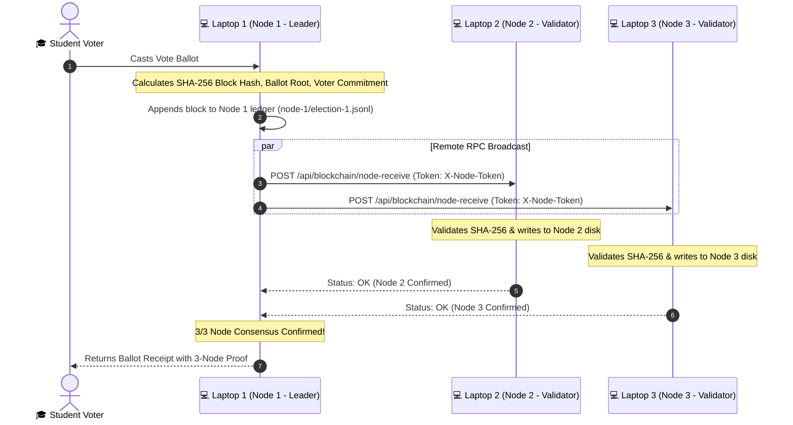

# 🔗 Multi-Laptop 3-Node Blockchain Setup Runbook

> [!abstract] Overview
> OrgChain implements a **Private Consortium Multi-Node Blockchain**. Each of the 3 laptops functions as an independent node validator holding its own append-only JSONL ledger (`election-1.jsonl`). When a ballot is sealed on Laptop 1, the block payload is broadcasted in real time via authenticated RPC to Laptop 2 and Laptop 3 over a local network or the internet.

---

## 🏛️ Node Roles and Topology



---

## 🚀 Step-by-Step Multi-Laptop Configuration

### 💻 Laptop 1: Primary Leader Node (Database + Admin + Voter Ingestion)

1. Ensure MySQL and Laragon/PHP are running on Laptop 1.
2. In Laptop 1's `.env`, configure:
   ```env
   BLOCKCHAIN_CURRENT_NODE=1
   BLOCKCHAIN_NODE_SECRET=orgchain-node-auth-secret-2026
   BLOCKCHAIN_NODE_TIMEOUT=5

   BLOCKCHAIN_NODE_1_URL=local
   BLOCKCHAIN_NODE_2_URL=https://node2.trycloudflare.com
   BLOCKCHAIN_NODE_3_URL=https://node3.trycloudflare.com
   ```
   *(Replace `BLOCKCHAIN_NODE_2_URL` and `BLOCKCHAIN_NODE_3_URL` with the actual Cloudflare URLs or LAN IPs from Laptop 2 & Laptop 3).*

3. Start the application server:
   ```powershell
   php artisan serve --host=0.0.0.0 --port=8000
   ```

---

### 💻 Laptop 2: Validator Node 2 (Auditor Desk)

1. Clone or pull the repository on Laptop 2:
   ```powershell
   git clone https://github.com/chals1029/OrgChainProject.git
   cd OrgChainProject
   composer install
   cp .env.example .env
   php artisan key:generate
   ```
2. In Laptop 2's `.env`, configure:
   ```env
   BLOCKCHAIN_CURRENT_NODE=2
   BLOCKCHAIN_NODE_SECRET=orgchain-node-auth-secret-2026
   ```
3. Start the node server:
   ```powershell
   php artisan serve --port=8000
   ```
4. Expose the node over the internet (if remote/far away):
   ```powershell
   cloudflared tunnel --url http://localhost:8000
   ```
   *(Send the generated `https://...trycloudflare.com` URL to Laptop 1).*

---

### 💻 Laptop 3: Validator Node 3 (Kiosk / Secondary Auditor)

1. Clone or pull the repository on Laptop 3:
   ```powershell
   git clone https://github.com/chals1029/OrgChainProject.git
   cd OrgChainProject
   composer install
   cp .env.example .env
   php artisan key:generate
   ```
2. In Laptop 3's `.env`, configure:
   ```env
   BLOCKCHAIN_CURRENT_NODE=3
   BLOCKCHAIN_NODE_SECRET=orgchain-node-auth-secret-2026
   ```
3. Start the node server:
   ```powershell
   php artisan serve --port=8000
   ```
4. Expose the node over the internet (if remote/far away):
   ```powershell
   cloudflared tunnel --url http://localhost:8000
   ```
   *(Send the generated `https://...trycloudflare.com` URL to Laptop 1).*

---

## 🔍 Verification & Demonstration Runbook

### 1. Live Ballot Sealing
- Submit a vote on **Laptop 1** (or from any voter station).
- The voter receipt displays the SHA-256 block hash and confirmations (`nodes_confirmed: 3`).

### 2. Physical File Verification
Inspect the local ledger file on each machine:
- **Laptop 1:** `storage/app/voting/chain/node-1/election-1.jsonl`
- **Laptop 2:** `storage/app/voting/chain/node-2/election-1.jsonl`
- **Laptop 3:** `storage/app/voting/chain/node-3/election-1.jsonl`

All 3 files will contain identical, cryptographically chained block entries.

### 3. API Node Verification Endpoint
Query the verification API on Laptop 1:
```text
GET http://localhost:8000/voting-system/api/blockchain/verify?reference=VOTE-XXXXXX
```
Response:
```json
{
  "api_version": "1.0",
  "result": {
    "ok": true,
    "message": "Ballot seal verified across all 3 nodes. Hash link is intact.",
    "nodes_matched": 3,
    "hash_link_ok": true
  }
}
```

---

## 🇵🇭 Gabay sa Taglish (Quick Reference para sa Team)

1. **Laptop 2 at Laptop 3**:
   - I-run: `git pull origin main` o `git clone https://github.com/chals1029/OrgChainProject.git`
   - I-set sa `.env` ang `BLOCKCHAIN_CURRENT_NODE=2` (para kay Laptop 2) o `BLOCKCHAIN_CURRENT_NODE=3` (para kay Laptop 3).
   - I-run: `php artisan serve --port=8000`
   - I-run sa pangalawang terminal: `cloudflared tunnel --url http://localhost:8000`
   - I-send ang Cloudflare link kay Laptop 1.
2. **Laptop 1**:
   - Ilagay sa `.env` ang mga link nina Laptop 2 at Laptop 3 sa `BLOCKCHAIN_NODE_2_URL` at `BLOCKCHAIN_NODE_3_URL`.
   - I-run: `php artisan serve --port=8000`.
3. **Pagkaboto**:
   - Sabay-sabay magse-save ang block sa hard drive ng bawat laptop (`node-1`, `node-2`, at `node-3`).
