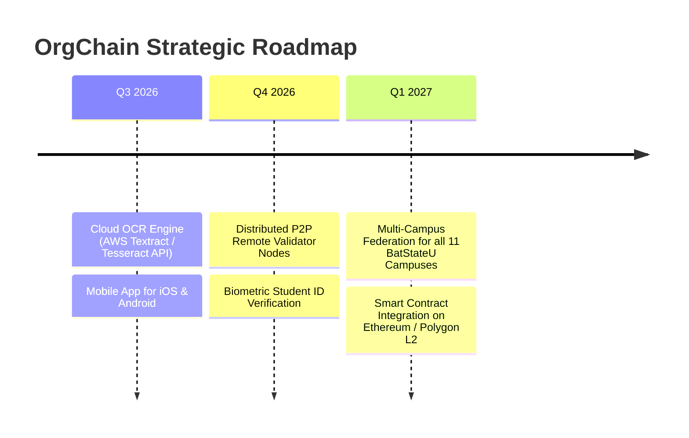

# 🗺️ Future Milestones & Features

---

## 🌟 Planned Major Features

### Near-term (pre-oral / next sprint)
1. **Renewal Adviser → Dean → OSO approvals** — promote name fields to real roles with comment/approve (see [[Organization Renewal Filing Window]]).
2. **Hard OSO-only gates** — `abort_unless` on Archive / TOSA (match Renewal 403 behavior).
3. **Playwright E2E suite** — migrate smoke to `@playwright/test`; add renewal + Advance journeys ([[Playwright Console Smoke Testing]]).

### Longer-term
1. **Cloud-Native OCR Engine**: Integrate Google Cloud Vision or AWS Textract to automatically detect itemized receipt tables, tax IDs, and vendor names.
2. **P2P Decentralized Node Network**: Distribute node-1, node-2, and node-3 across separate physical server blades on different university campuses.
3. **Multi-Campus Federation**: Expand OrgChain from the main campus to all 11 constituent campuses across Batangas province.
